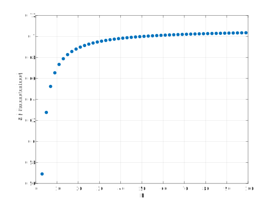
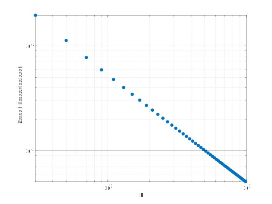
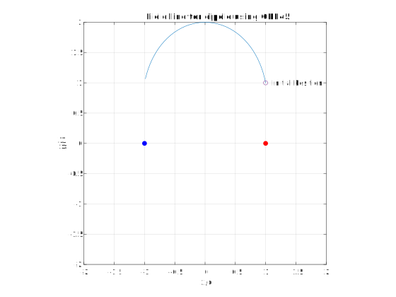
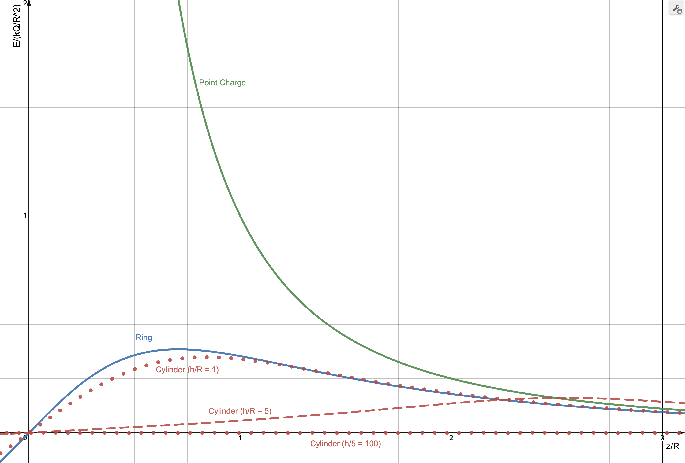
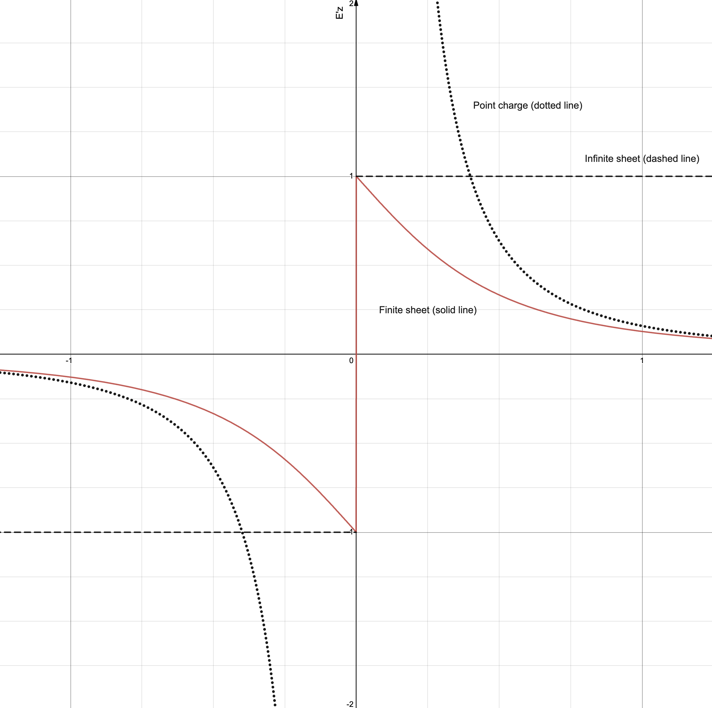
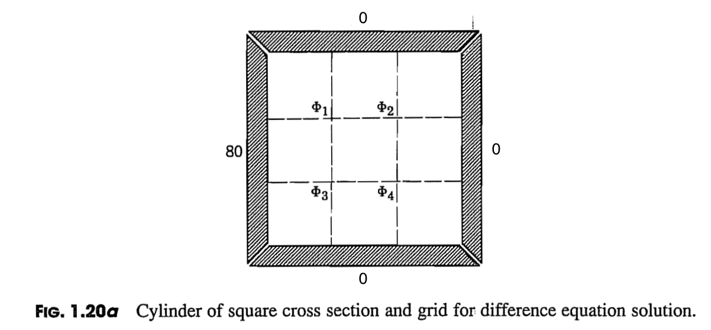

# HW 1

Due August 31st at 11:59 pm.

If you are stuck, please ask questions on Discord or send me questions via email.

Turn in all of your answers on paper.

## Continuous Charge Distribution Approximation

In E&M, we often assume that point charges are continuously distributed. This problem addresses the accuracy of this approximation.

A line of length $2L$ is centered on the origin and lies between $-L\le x\le L$. The charge density, $\lambda_o$, on the line is uniform.

If the line is approximated by an odd number of point charges (odd number so a charge is always at the origin) separated by a distance $\Delta$ and is used to compute the approximate electric field $E_{ya}$ on the $y$-axis at $y=L$, how many charges are required so that

$$\left|\frac{E_{ye}(0,L)-E_{ya}(0,L)}{E_{ye}(0,L)}\right|\le 0.01$$

where the exact solution is given by $E_{ye}$. 

You may look up the exact solution, but cite your source. You may use any program or a calculator to solve this problem. Save your program as a file with name <code>HW1_1.ext</code>, where <code>ext</code> is the file extension for your program, e.g., <code>m</code>, <code>py</code>, etc.

Print out the code you used for your answer and write the actual answer it yields in a comment.

**Solution**

The exact solution is (Griffiths 4th Edition, example 2.2):

$$E_y=2k\lambda_oL\frac{1}{y\sqrt{y^2+L^2}}$$

We want to re-write this is a form that will allow cancellation of constants that were not given when the above ratio is computed. Using $\lambda_o=Q/2L$, we have

$$E_y=\frac{kQ}{L^2}\frac{1}{\ds\frac{y}{L}\left[1+\left(\frac{y}{L}\right)^2\right]^{1/2}}$$

With $y=L$, 

$$E_y=\frac{kQ}{L^2}\frac{1}{\sqrt{2}}$$

For a charge $Q$ at position $(x,y)$

$$E_y=kQ\frac{z}{(y^2+x^2)^{3/2}}$$

Setting $y=L$, this can be written as

$$E_y=\frac{kQ}{L^2}\frac{1}{\ds\left[1+\left(\frac{y}{L}\right)^2\right]^{3/2}}$$

To compute the field due to multiple charges, we need to place charges at $x=-L,-L+\Delta, ..., L$. The spacing $\Delta/L$ is $2/(N-1)$.


With $kQ/L^2$ term omitted, the sum is

$$S(N)\equiv\frac{1}{N}\sum_{i=-(N-1)/2}^{(N-1)/2}\frac{1}{\ds\left[1+(i\Delta)^2\right]^{3/2}}$$

Before implementing, check that this sum is correct by expanding it for $N=3$, $N=5$.

**Important**: I want to see checks like this in your code. In analytical problems you should always use limits to check answer. In numerical problems, you should always use some sort of check on a reduced problem to check your implementation. The following checks took me some time, but because I had them, I was able to catch errors very quickly and also have confidence in my result. In my code, I also created two plots to help me build confidence in my result; see below. I plotted the sum as a function of $N$ and verified that it converged to a constant value (initially it did not, because I forgot to divide sum by $N$). I also plotted the error as a function of $N$ to verify that it was monotonically decreasing. (If it started increasing at some value of $N$, I would know that something went wrong.)

$N=3$, $\Delta=1$ and we want the sum terms to correspond to charges at $x/L=-1, 0, $ and $1$.

$$S(N)=\frac{1}{3}\sum_{i=-1}^{1}\frac{1}{\ds\left[1+(i\Delta)^2\right]^{3/2}}=
\frac{1/3}{\ds\left[1+(-1)^2\right]^{3/2}}+
\frac{1/3}{\ds\left[1+(0)^2\right]^{3/2}}+
\frac{1/3}{\ds\left[1+(1)^2\right]^{3/2}}
$$

The result is $0.569035593728849$. This value is used in the following program as a check.

$N=5$, $\Delta=2/(N-1)=1/2$ and we want charges at $x/L=-1, -1/2, 0, 1/2, $ and $1$.

$$S(N)=\frac{1}{5}\sum_{i=-2}^{2}\frac{1}{\ds\left[1+(i\Delta)^2\right]^{3/2}}=
\frac{1/5}{\ds\left[1+(-1)^2\right]^{3/2}}+
\frac{1/5}{\ds\left[1+(-1/2)^2\right]^{3/2}}+
\frac{1/5}{\ds\left[1+(0/2)^2\right]^{3/2}}+
\frac{1/5}{\ds\left[1+(1/2)^2\right]^{3/2}}+
\frac{1/5}{\ds\left[1+(1\Delta)^2\right]^{3/2}}
$$

The result is $0.627638057357283$.

Notice the fact that the first two and last two terms evaluate to the same value. This can be used to reduce the number of computations.

To finish the problem, evaluate 

$$\left|\frac{1/\sqrt{2}-S(N)}{1/\sqrt{2}}\right|\le 0.01$$

or $|1-\sqrt{2}S(N)|\le 0.01$

for odd positive values of $N$ until the inequality is satisified. The result should be $N=51$. 

The following two figures were used to check my algorithm. [Source code](solns/HW1_1.m)





## Charge on Cylinder

Charge is uniformly distributed on the curved surface of a cylinder of length $h$ and radius $R$. The cylinder is centered on the origin, aligned with the $z$--axis, and has a uniform charge density of $\sigma_o$.


Find $\mathbf{E}(z)$. Prior to doing any calculations, document limiting cases that you can use to check your answer.

**Answer**

Limiting cases:

* Expect zero at origin.
* Expect ring of charge solution as $h/R\rightarrow 0$
* Expect infinite cylinder solution when $h\gg R$

We also expect $E_z(z) = -E_z(z)$ (symmetry)

The field for uniformly charged ring in the $x$--$y$ plane and centered on the origin is

$$E_z=2\pi R\lambda k\frac{z}{\left(z^2+R^2\right)^{3/2}}=kQ\frac{z}{R}\frac{1}{\left(1+(z/R)^2\right)^{3/2}}$$

If the ring is translated along the $z$--axis by $z'$, this corresponds to a translation of the coordinate system and we can write

$$E_z=\frac{kQ}{R^2}\frac{\ds\left(\frac{z-z'}{R}\right)}{\ds\left(1+\left(\frac{z-z'}{R}\right)^2\right)^{3/2}}$$

If we consider differential rings of height $dz'$, their area is $2\pi Rdz'$ and charge is

$dQ=(2\pi Rdz')\sigma_o$

Replacing $E_z$ with $dE_z$ and $Q$ with $dQ$ in the last equation for $E_z$, we have

$$dE_z(z)=2\pi R k\frac{dz'}{R^2}\frac{\ds\left(\frac{z-z'}{R}\right)}{\ds\left(1+\left(\frac{z-z'}{R}\right)^2\right)^{3/2}}$$

and this must be integrated from $z'=-h/2$ to $z'=h/2$. The result is

$$E_z(z)=
\frac{kQ}{R^2}
\left[
\frac{1}{h_R\sqrt{(\frac{z}{R}-\frac{h_R}{2})^2+1}}-
\frac{1}{h_R\sqrt{(\frac{z}{R}+\frac{h_R}{2})^2+1}}
\right]
$$

where $h_R \equiv h/R$. 

(The solution was written in this form in anticipation for a problem on HW #2.)

Checks:

* $E_z(0)=0$ is satisfied.
* The symmetry condition $E_z(z) = -E_z(z)$ is satisifed.
* We expect ring of charge solution as $h/R=h_R\rightarrow 0$. However, when we plug this into the above, we get $1/0-1/0$, which is indeterminate.
* Expect infinitely long and uniformly charged cylinder solution when $h\gg R$ (or $h_R\gg 1$). When we plug this into the above, we get $0$. This can be shown to be correct using Gauss's law, from which it follows that $E_z=0$ at all points inside the cylinder (not only along $z$--axis, which we computed above).

Addressing the last two limits requires a significant amount of effort ([see related problem](https://rweigel.github.io/phys685/hw.html#surface-current-on-cylinder)). In the next homework, you will consider an alternative approach.

## Reading

Next week, Gauss's law will be covered. Find at least one freshman--level textbook and read the sections that cover Gauss's law. Do the same for at least one upper--division undergraduate--level textbook (the references on the syllabus has a list of textbooks, but you may pick your own).

In the next class,

* We will have a general discussion on the the similarities and differences in how Gauss's law is presented and explained.
* I will randomly select students (or groups) to present the solution to a problem. Prepare notes for a 5--7 minute presentation. During your presentation, I will ask the class for clarifications and connections to other problems. You are welcome, and encouraged, to work with one or two other students on this.

Turn in your notes that you have prepared for a presentation.

# HW 2

Due September 7th at 11:59 pm. I will consider extension requests, for any problem _except_ problem 2.4. Problem 2.4 is a review problem that I want everyone to have solved so they have the required background for what I will discuss in class.

If you are stuck, please ask questions on Discord or send me questions via email.

## Field Lines

Many students have never actually written a program to draw field lines. In doing so, you'll gain a bit of insight into how the field line drawings you see in books are created. In addition, you'll appreciate some of the limitations of field lines. In the development of the theory of electricity and magnetism, the concept of a field line was central. (They were introduced by Faraday and Maxwell referred to and used them extensively.) In addition, the textbook emphasizes field lines and "tubes of flux".

**Background**

Consider a 2-D vector field defined by

$$\mathbf{F} = F_x(x,y)\hat{\mathbf{x}} + F_y(x,y)\hat{\mathbf{y}}$$

A field line is a line that is always tangent to the vector $\mathbf{F}$.

To determine the equations that must be solved to find the field line, consider a differential distance $ds$ drawn in the direction of $\mathbf{F}$ at a given point. This step has a horizontal component of $dx$ and a vertical component of $dy$.


The differential triangle is similar to a triangle formed with $a$ $F_x$ in the $x$-direction, $F_y$ in the $y$-direction, and $F$ as the hypotenuse so that

$$\frac{dx}{ds} = \frac{F_x(x,y)}{F(x,y)}$$

$$\frac{dy}{ds} = \frac{F_y(x,y)}{F(x,y)}$$

where $F(x,y)=\sqrt{F_x^2+F_y^2}$.

We have now formulated the statement "a field line is a line that is always tangent to the vector $\mathbf{F}(x,y)$" as a set of two differential equations. The field line corresponds to the solution for $x(s)$ and $y(s)$ and the quantity $s$ corresponds to the length of the field line.

To compute $x(s)$ and $y(s)$, we can solve the above equations in the same way that differential equations for the trajectory of a particle are solved. Using the Forward Euler approximation

$$\frac{dx}{ds} \simeq \frac{x(s+\Delta s)-x(s)}{\Delta s}$$

$$\frac{dy}{ds} \simeq \frac{y(s+\Delta s)-y(s)}{\Delta s}$$

gives

$$x(s+\Delta s) = x(s) + \Delta s\frac{F_x(x(s),y(s))}{F(x(s),y(s))}$$

$$y(s+\Delta s) = y(s) + \Delta s\frac{F_y(x(s),y(s))}{F(x(s),y(s))}$$

To find the field line, we must specify initial positions $x(0)$ and $y(0)$ and also a step size $\Delta s$ and then iterate the above two equations. Discretized, the above two equations are

$$x_{i+1} = x_i + \Delta s\frac{F_x(x_i,y_i)}{F(x_i,y_i)}$$

$$y_{i+1} = y_i + \Delta s\frac{F_y(x_i,y_i)}{F(x_i,y_i)}$$

**Problem**

The electric field caused by a $+q$ charge at $(x',y',z')$ is

$$\mathbf{E}(x,y,z) = kq\frac{(x-x')\hat{\mathbf{x}}+(y-y')\hat{\mathbf{y}}+(z-z')\hat{\mathbf{z}}}{\big[(x-x')^2+(y-y')^2+(z-z')^2\big]^{3/2}}$$

Write a program that draws the field lines in the $x$-$y$ plane for a dipole: $+q$ at $(x,y,z)=(d,0,0)$ and $-q$ at $(x,y,z)=(-d,0,0)$. You may use the Forward Euler method, but I encourage you to use a better algorithm using an existing library (such as MATLAB's <code>ODE45</code> or SciPy's <code>ODEINT</code> or <code>SOLVE_IVP</code> **if you have prior experience with them**). I have intentionally not specified how many lines to draw or given values for $q$ and $d$.

**Sample Code**

As an example of solving two ODES, in the following, I solve the two equations

$\ds\frac{dx}{dt}=x \qquad \frac{dy}{dt}=-y$

numerically using the Forward Euler approximation. In this approximation, the equations can be rewritten as

$x_{i+1}=x_{i} + \Delta t x_i \qquad y_{i+1}=y_{i} - \Delta t y_i$

I use the parameter $\Delta t = 0.01$, which controls the accuracy of the solution. (Note that the Forward Euler approximation is not a good method for solving ODEs, but it is simple and easy to implement.)

*Spreadsheet*

In this [Spreadsheet](https://docs.google.com/spreadsheets/d/1AL08kI-UhRC2qocJcrxnJI52Ckd4w6jVyTn41J3qY5s/edit?usp=sharing), I solve the two equations using the Forward Euler approximation with $\Delta t = 0.01$.

*MATLAB*

You can access MATLAB using the Citrix Virtual Lab: https://its.gmu.edu/service/citrix-virtual-lab/. Make sure to install the app first. The instructions say it is recommended, but I was not able to get things to work until I installed the app.

```bash
function ode_demo()

    %% Forward Euler
    dt = 0.01;

    t = 0;
    x(1) = 1;
    y(1) = 1;
    Nsteps = 100;

    fprintf('t\tx\ty\n')
    for i = 1:Nsteps-1
        fprintf('%.1f\t%.1f\t%.1f\n',t(i),x(i),y(i));
        x(i+1) = x(i) + dt*x(i);
        y(i+1) = y(i) - dt*y(i);
        t(i+1) = t(i) + dt;
    end

    plot(x,y);
    hold on;
    xlabel('x')
    ylabel('y')
    title('$dx/dt=x; dy/dt=-y$; x(0)=y(0)=1','Interpreter','Latex');

    %% Runge-Kutta

    function ret = dXdt(t, X)
        % For MATLAB ODE functions, must specify code that computes right-hand
        % side of differential equations. Here we have
        % dx/dt = x
        % dy/dt = -y
        %
        % Defining X = [x, y], in matrix notation
        %   dX/dt = [x; -y]
        ret = [X(1); -X(2)];
    end    

    [t, X] = ode45(@dXdt, [0, 1], [1, 1]);

    plot(X(:,1),X(:,2),'r-');

    legend('Forward Euler', 'Runge-Kutta 4-5');
end
```

Save your as a file with name <code>HW2_1.ext</code>, where <code>ext</code> is the file extension for your program, e.g., <code>m</code>, <code>py</code>, etc. Save a PDF or PNG of your plot and name it <code>HW2_1.png</code> or <code>HW2_1.pdf</code>. If you used a spreadsheet, you do not need to upload an image; instead upload the spreadsheet file (if you used Google Docs, create a file named <code>HW2_1.link</code> and paste the link to your Google Spreadsheet; make sure that your spreadsheet is visible to anyone with the link).

**Comments**

Several students used the MATLAB function `streamline` or `quiver`. This are acceptable functions to use in general for visualizing a vector field. However, this problem involved writing code that would draw a field line with the motivation that you would understand the basic algorithm of taking a steps in the horizontal/vertical direction in proportion to the electric field in horizontal/vertical direction.

In retrospect, I modified the problem statement to include the bold passage below because students assumed that I meant use "`ODE45`". In general, if you have having difficulties with a problem, attempt an easier approach first. This is especially true for computational problems.

> ... but I encourage you to use a better algorithm using an existing library (such as MATLAB's <code>ODE45</code> or SciPy's <code>ODEINT</code> or <code>SOLVE_IVP</code> **if you have prior experience with them**) ...

**Solution**

[Code to generate one field line](solns/HW2_2.m) using either Forward Euler or `ode45`.



## Limiting Behavior For Cylinder

In the previous HW, you computed the electric field along the centerline of a cylinder with a uniform surface charge on its curved surface.

Showing that the equation approaches the equation for a point charge at the origin when $z\gg R$ and $z\gg h$ is not trivial. (Plugging $R=0$ and $h=0$ gives $E_z(z)=0$.) To show that $E_z(z)$ has the correct limiting behavior mathematically is quite involved. As an alternative, we will check the limit graphically.

Create a plot of $E_z(z/R)/E_o$, where $E_o = kQ/R^2$ for (that is, plot $E_z/E_o$ vs $z/R$):

1. A point charge $Q$ at the origin
2. A ring of radius $R$ that is centered on the origin and lies in the $x$--$y$ plane with a uniformly distributed charge $Q$.
3. The cylinder considered on the previous homework assuming for three cases: $h/R=1$, $h/R=5$, and $h/R=100$.
 
Be prepared to provide a physical explanation for the features of the curves and the ratios of $h/R$.

\ifsolutions
**Solution**

The following plot was created using https://www.desmos.com/calculator/vg2dblcbfc. This page is interactive, so you can adjust the $h/R$ ratio.

Comments:

* By using the dimensionless ratio, we can easily compare the fundamental features of the cylinder equation using only one parameter. If instead we plotted $E$ vs $z$, we would need to plot the equation for many values of $R$ and $h$ to understand the full range shapes the equation can have.
* As $h/R$ decreases, the cylinder solution approaches the ring solution. For $h/R=0.1$, the lines for the ring and cylinder cannot be distinguished by eye.
* For $h/R=1$, the cylinder and ring curves increasingly overlap starting at approximately $z/R=1$. This means the cylinder field is becoming more and more like the ring field as $z/R$ increases, which is expected.
* The ring and cylinder curves (for $h/R=1$) overlap with the point charge curve for large $z/R$. This is expected because both being to "look" like a point charge as you move away from them.
* The explanation for the curve approaching zero as $r/R$ increases is in this limit, the cylinder appears to be "long". Inside of an infinitely long cylinder $h/R\rightarrow \infty$, the field is zero (even off--axis). This can be shown by using Gauss's law.
* All curves have odd symmetry ($E(-z)=-E(z)$), as expected -- the field for $z>0$ is positive and the field for $z<0$ is negative. (The image below only shows $z/R > 0$.)


\fi

## Checking Gauss's Law

Given a point charge $Q$ at the origin, compute the electric flux $\Phi_E=\int\mathbf{E}\bfcdot d\mathbf{A}$ through one face of a cube that is also centered on the origin using Coulomb's law and explicit evaluation of the integral.

\ifsolutions

**Solution**

From Gauss's law, the net flux through any _closed_ surface is $Q_{encl}/\epsilon_o$. The net flux through the cube's surface is $Q/\epsilon_o$, and the flux must be the same through each face, so we expect the answer to be $Q/6\epsilon_o$. In this problem, you are being asked to show that you get the same result without using Gauss's law.

Several students solved for case when cube was not centered on the origin but rather had one corner at the origin and edges along the cartesian coordinate axes. In this case, one can conclude the flux through one face should be $Q/24\epsilon_o$. This is equivalent to asking if we split the given cube into $8$ sub--cubes, what is the flux through the outer face of one of the sub-cubes. In this case, the face area of the sub--cube is $1/4$ of the area of the main cube. In addition to being the wrong problem, the solution given does not use Coulomb's law and explicit evaluation of the integral. (The motivation for this problem is to reinforce the idea that Gauss' law holds for arbitrary surfaces and as practice for setting up integration.)

In general,

$\mathbf{r}=x\xhat + y\yhat + z\zhat$. If we assume the side length is $2a$, then for the top side, $\mathbf{r}=x\xhat + y\yhat + a\zhat$.

We need to evaluate

$$\Phi_E=\int_{\text{top}}\mathbf{E}\bfcdot d\mathbf{A}$$

Using

$\ds\mathbf{E}=kq\frac{\mathbf{r}}{r^3}$ and $d\mathbf{A}=dxdy\hat{\mathbf{z}}$, the integral is

$$\Phi_E=kq\int_{-a}^{a}dy\int_{-a}^{a}\frac{adx}{\sqrt{a^2+x^2+y^2}^{3/2}}$$

or, nondimensionalizing the integral using $x\rightarrow x/a$ and $y\rightarrow y/a$,

$$\Phi_E=kq\int_{-1}^{1}dy\int_{-1}^{1}\frac{dx}{\sqrt{1+x^2+y^2}^{3/2}}$$

Defining $b^2=1+y^2$ and using [Wolfram Alpha for the integration](https://www.wolframalpha.com/input?i=integrate+1%2F%28sqrt%28b%5E2%2Bx%5E2%29%29%5E%283%29+from+-1+to+1), we have

$$\Phi_E=kq\int_{-1}^{1}dy\frac{2}{(1+y^2)\sqrt{2+y^2}}$$

Using [Wolfram Alpha](), $\Phi_E=kq(2\pi/3)=q/6\epsilon_o$.
\fi

## Charge on Concentric Thick Shells

Charge placed on concentric spherical conducting shells, the cross--section of which is shown. Both shells have a thickness of $t$. The inner shell has an outer radius of $a$ and a net charge of $-Q$. The outer shell has an inner radius of $b$ and a net charge of $+Q$. Assume that $Q$ is positive.


Using Gauss's law and the fact that the electric field inside a conductor must be zero show that

1. there can be no charge on the inner surface of the inner conductor,

   \ifsolutions
    **Answer**: A Gaussian sphere with a surface inside the inner conductor has $E=0$ on its surface (b/c $E$ inside a conductor is zero). Based on $\oint \bfvec{E}\bfcdot d\mathbf{l}=Q_{\text{encl}}/\epsilon_o$, this implies $Q_{\text{encl}}=0$. (Note that all charges must be on the surface of a conductor, so the only possible location for the charge is on the inner and outer surfaces.)
   \fi

2. the charge on the inner surface of the outer conductor is $+Q$, and

   \ifsolutions
    **Answer**: A Gaussian sphere with its surface inside the outer conductor has $E=0$ on its surface (b/c $E$ inside a conductor is zero). Based on $\oint \bfvec{E}\bfcdot d\mathbf{A}=Q_{\text{encl}}/\epsilon_o$, this implies $Q_{\text{encl}}=0$. The charge on the inner conductor was given as $-Q$. To make the charge inside the Gaussian sphere zero, we need $+Q$ on the inner surface of the outer conductor to get $Q_{\text{encl}}=0$.
   \fi

3. there is no charge on the outer surface of the outer conductor.

   \ifsolutions
    **Answer**: If the total charge on the outer conductor is $+Q$ and all of it is on its inner surface, but conservation of charge, there is no charge on its outer surface. Recall that charges arrange themselves on a conductor to make the electric field inside all conductors zero. With this charge arrangement, the field due to the charges on the outer surface of the inner conductor cancels the field due to the charge on the inner surface of the outer conductor for $r>b$.
   \fi

4. Find the electric field in each of the five labeled regions and sketch a plot of $E/(kQ/a^2)$ versus $r/a$. Region 1. is the empty volume inside of the inner conductor, region 2. is the inner conductor, region 3. is the empty volume between the conductors, region 4. is the outer conductor, and region 5. is the region outside of the outer conductor. (Hint: Use Gauss's law several times; when not zero, the electric field should be proportional to $1/r^2$.)

   \ifsolutions
   **Answer**: 1. $E=0\quad$ 2. $E=0\quad$ 3. $E/(kQ/a^2)=-1/(r/a)^2\quad$ 4. $E=0\quad$ 5. $E=0$
   \else
   \vspace{4em}
   \fi

5. Recall that because the electric field has the form of $\rhat/r^2$, we can always find a scalar function $\psi$ (which we call electric potential) such that

   $$\mathbf{E}=-\boldsymbol{\nabla}\psi = -{\partial \psi \over \partial x}\xhat - {\partial \psi \over \partial y}\yhat - {\partial \psi \over \partial z}\zhat$$

   It can be shown that this equation can be inverted:
   
   $$\psi(\mathbf{r})-\psi(\mathbf{r}_o)=-\int_{\mathbf{r}_o}^{\mathbf{r}}\mathbf{E}\bfcdot d\mathbf{l}$$
   
   where the integral is taken over _any_ path between the points given by $\mathbf{r}$ and $\mathbf{r}_o$.

   In one dimension, assuming the integration path is radial, and choosing $\mathbf{r}_o$ to be the origin, we have
   
   $$\psi(r)-\psi(0)=-\int_0^rE_r(r)dr$$
   
   Assume $\psi(0)=0$ (I will discuss why this choice is arbitrary in class) and using $E$ found in part 4., find and sketch a plot of $\psi/(kQ/a)$ versus $r/a$.
   
   In class, I will ask for a physical explanation for why I will get the same result if I choose a different integration path. For example, if my integration path was radial, then tangential, then radial again. This is covered in most intro textbooks. I'll also ask why I ask for plots of dimensionless parameters in this problem and in other problems on this HW.

   \ifsolutions
   **Solution**

    In region 1, $\ds\psi(r)-\psi(0)=-\int_0^r 0 dr \Rightarrow \psi(r)=0$ and $\psi(a-t)=0$.

    In region 2, $\ds\psi(r)-\psi(a-t)=-\int_{a-t}^r 0 dr \Rightarrow \psi(r)=0$ and $\psi(a)=0$.
    
    The fact that the potential is constant in region 2. is consistent with the expectation that a conductor is an equipotential.

    In region 3, $\ds\psi(r)-\psi(a)=kQ\int_a^r 1/r^2 dr \Rightarrow \psi(r)=kQ(1/a-1/b)$ and $\psi(b)=kq(1/a-1/b)$

    Note that the potential at $b$ is larger than that at $a$, which is expected because 

    In region 5, $\ds\psi(r)-\psi(c)=-\int_0^r 0 dr \Rightarrow \psi(r)=\psi(c)$.

   \fi

# HW 3

Due September 14th at 11:59 pm.

If you are stuck, please ask questions on Discord or send me questions via email.

## Limiting Behavior (Again)

A square sheet of charge with side length $w$ that lies in the $x$--$y$ plane and is centered on the origin has an electric field along the $z$--axis of

$$E_z(z)=\frac{\sigma_o}{\pi \epsilon_o}\tan^{-1}\left[\frac{w^2}{4z}\frac{1}{\sqrt{z^2+w^2/2}}\right]$$

1. State two limits that can be used to check this equation.
2. Check the limits mathematically (hint: you will need to use for a Taylor series for one limit and a Laurent series for another limit. See [Wolfram Alpha's information on $\tan^{1}(x)$](https://www.wolframalpha.com/input?i=atan%28x%29) or [proofwiki](https://proofwiki.org/wiki/Power_Series_Expansion_for_Real_Arctangent_Function) for small and large $x$).
3. Plot $E_z(z')/E_o$ vs. $z'$, where $z'=z/w$ and $E_o=\sigma_o/2\epsilon_o$. Discuss the features of the curve (see HW 2.2 for an example) and how they match the curves for the two limiting cases, which you should plot on the same axis. (Plot using a program such as Desmos, Python, MATLAB, etc.).

\ifsolutions
**Solution**

A common approach in the student solutions was to state a limit such as $z/w\ll 1$ and then use equation to evaluate limit. Here I asked you to work out what you expect the solution to be in the limits _first_. This is typically what one does _before_ attempting to find a complicated solution, which in this case was given.

Also, several students who used MATLAB put in values for $w$, $\epsilon_0$, and $\sigma_0$. The point of non-dimensionalization is that you don't need to deal with these to get a full understanding of how the equations behaves. Given the non-dimensional curve, one can easily figure out $E$ for _any_ $w$ and $\sigma_0$.

1. Recall that

   $$
   \text{sign}(x) =
   \begin{cases}
   \phantom{-}1\text{ for } x\gt 0 \\
  -1\text{ for } x\lt 0
   \end{cases}
   $$

  * Far away ($z'\gg 1$), field should apprach that of a point charge with $Q=\sigma_ow^2$

    $$E_z/E_o=\frac{1}{2\pi}\frac{1}{z'^2}\text{sign}(z')$$
    
    A common error was the omission of $\text{sign}(z')$. Without it, the equation implies the field is always in the $+z$ direction; however, for $z<0$, the $E_z < 0$ since the field points away from the origin.

  * Near the surface ($z'\ll 1$), field should approach that of an infinite and uniformly charged sheet

    $$E_z/E_o = \text{sign}(z)$$

2. In dimensionless form, we have 

   $$\frac{E_z(z')}{E_o}=\frac{2}{\pi}\tan^{-1}\left[\frac{1}{4z'}\frac{1}{\sqrt{z'^2+1}}\right]$$

   For $z'\ll 1$, the argument to $\tan^{-1}$ is large. From the sources cited $\tan^{-1}(x)\approx \text{sign}(x)\pi/2$ for large $x$ (Wolfram only gives large positive $x$, but $\tan^{-1}(x)$ is an odd function, so the limiting value depends on the sign of $x$).

   $$\frac{E_z(z')}{E_o}\rightarrow\frac{2}{\pi}\frac{\pi}{2}\text{sign}(z')=\text{sign}(z')$$

   For $z'\gg 1$, the argument to $\tan^{-1}$ is small. From the sources cited $\tan^{-1}(x)\approx x$ for small $x$. 

   $$\frac{E_z(z')}{E_o}\rightarrow\frac{2}{\pi}\left[\frac{1}{4z'|z'|}\right]=\frac{1}{2\pi}\frac{1}{z'^2}\text{sign}(z')$$

   (Technically, we should do a Taylor series expansion of the full equation instead simply replacing $z'^2+1$ with $z'^2$ and $\tan^{-1}(f(z'))$ with $f(z')$, but the result is the same.)

3. From https://www.desmos.com/calculator/nkxxr4fioy:

   

   Curve matches the two limits given in part 1. For $|z|/w > 1$, field of finite sheet is less than $2$% different from the field when all of the charge is collapsed onto the origin. To be within $\sim 2$% of the field of an infinite sheet, one needs $|z|/w \lt 1/100$. (I expected the curve to be flatter near $z=0$ so that the range for which the infinite sheet was accurate was larger.)
\fi

## Computing Capacitance

In HW 2.4, you computed the potential difference between two conductors, given one had a net charge of $Q$ and the other $-Q$. The definition of the capacitance for two conductors is

$$C=\frac{Q}{|\Delta V|}$$

where $Q>0$ and $\Delta V$ is the difference in potential between the conductors when they have an equal and opposite amount of charge. (One often sees the definition of capacitance without the absolute value; in this cases $\Delta V$ is the $V_{+Q}-V_{-Q}$, that is, the potential of the $+Q$ conductor minus the potential of the $-Q$ conductor.)

To find the difference in potential, a line integral was used. This equation does not specify the path of integration.

1. Why?

2. Compute the capacitance of the system considered in HW #2.4.

In HW 2.4, you used Gauss's law to find $E$ and then found $\Delta V$ by integrating $E$ and then used the equation for capacitance. This approach can only be used for systems where $E$ can be found using Gauss's law.

An alternative is to use Laplace's equation. In spherical coordinates with variation only in the radial direction, it is

$$
\nabla^2\Phi(r)=
{1 \over r^{2}}{\partial \over \partial r}\left(r^{2}{\partial \Phi \over \partial r}\right)=0
$$

3. Find the general solution to this equation (it should have two unknown constants; see a related derivation on [page 40 of the textbook](https://drive.google.com/file/d/1zmcFCJX_in4Z3Z6UoQum0ERrJlFfN8Lh/view?usp=drive_link)).
4. Assume the outer conductor is at a potential of $V_o$ and the inner at $0$. Find $V(r)$ for $a\le r\le b$.

We need to know $\Delta V$ and $Q$ in the capacitance equation. Here we were given $\Delta V$ and don't know $Q$ (reverse of the Gauss's law case). However, we know $E$ is related to $V$ and also that just outside a conductor, the charge density is related to $E$ via $\sigma=\epsilon_o\mathbf{E}\cdot\hat{\mathbf{n}}$, where $\hat{\mathbf{n}}$ is the normal unit vector to the conducting surface with outward positive.

5. Use $V(r)$ to find $E(r)$.
6. Find the charge density and then charge on each conductor.

   \ifsolutions
    **Answer**
    A common problem occured when when $\sigma$ was computed. The formula is $\sigma=\epsilon_o\mathbf{E}\bfcdot \hat{\mathbf{n}}$ where $\mathbf{E}$ is evaluated on the surface. In this problem, the surface charge density should not depend on $r$. On the inner/outer surfaces, $r=a$ or $r=b$ should be substituted into the equation for $\mathbf{E}$.
   \fi
7. Find the capacitance using $V_o$ and the charge computed in the previous step.
   \ifsolutions
   **Answer**
   A common problem was a mis--match between this capacitance and the capacitance computed using Gauss's law. If you did not get the same answer, you should recognize and document that you know that you should have.
   \fi

(If you want to work ahead, develop a numerical solution of this problem.)

## Laplace's Equation in Two Dimensions -- Numerical

1. Verify the numbers in the textbook's Step 1 column of Table 1.20 of Ramo. Show your calculations on a piece of paper. (In class, we will start developing a program to compute the potentials in the other columns.)
2. Find the equation for this problem's exact potential if all sides are set to have zero potential except the side at $80\text{ V}$. I recommend finding a solution first and using it to answer this part; if you have time, attempt to derive it.

(If you want to work ahead, develop a numerical solution to this problem and compare it to the exact solution.)

\ifsolutions
**Answers**

1.
   * $\Phi_1=77.50$
   * $\Phi_2=65.62$
   * $\Phi_3=70.62$
   * $\Phi_4=54.06$
2. This problem is given in many books as an example and here I expected you to research to find a solution. Problem 3.54 of Griffiths 4th Edition has a solution for the case when the origin is at the bottom center of the duct, the top is held at $V$, the width is $2b$ and the height is $a$.

   $$\Phi(x,y) = -\frac{2V}{b}\sum_{n=1}^{\infty}\frac{(-1)^n}{\alpha_n}\frac{\sinh(\alpha_n y)}{\sinh(\alpha_n a)}\cos(\alpha_n x)$$

   where $\alpha_n=(2n-1)\pi/2b$. To transform this to the problem we are given, first set the width $2b$ to $1$ and height $a=1$. Then

   $$\Phi(x,y) = -4V\sum_{n=1}^{\infty}\frac{(-1)^n}{\alpha_n}\frac{\sinh(\alpha_n y)}{\sinh(\alpha_n)}\cos(\alpha_n x)$$

   $\alpha_n=(2n-1)\pi$. If we choose a coordinate system the is centered on the right edge of Figure 1.20a with $y$ to the left and $x$ upwards, this equation can be used.

   One can show that if the origin is placed at the lower left of the duct in Figure 1.20a, with $x$ to the right and $y$ up, the potential is
   $$\Phi_l(x,y)=\frac{4V}{\pi}\sum_{n=1,3,...}^\infty \frac{\sin(n\pi y/y_0)}{n\sinh (n\pi y_0/x_0)}\sinh\left[n\pi(x_0-x)/y_0\right]$$

   where $V=80\text{ V}$ and the width $x_o=1$ and height $y_o=1$.
\fi

# HW 4

Save your solutions in a file named `HW4.pdf` and upload it to your repository.

## A Model of Polarization

In Example 4.3 of Griffiths (3rd and 4th Edition), he models a polarized sphere by using two uniformly charged spheres with centers that are separated by a small distance. 

In this problem, a polarized slab will be modeled using two slabs of charge with uniform and opposite charge density that are offset by a small distance $\delta$.

1. Find $\mathbf{E}^+(y)$ for the slab with uniform charge density $\rho_o$ shown in the following figure. Assume that the slab is infinite in extent in the $\pm z$ and $\pm x$ directions so that Gauss's law can be used to find $\mathbf{E}$. (This slab can be thought of as being composed of thin sheets of charge stacked together and so an alternative to using Gauss's law is to sum the electric field due to sheets of charge.)

   

2. Sketch (by hand) $\mathbf{E}^+(y)$ vs $y$. Label key points on the $y$--axis.

3. Next, compute and ~plot~ sketch $\mathbf{E}^-(y)$ for the same slab if it had charge density of $-\rho_o$ and was shifted by $-\delta$ in the $y$--direction. Assume that $\delta\ll t$.

4. Compute and sketch $\mathbf{E}^+ + \mathbf{E}^-$.

The primary motivation of this problem is to justify the claim that the field of a polarized object can be computed not by finding the field due to all of the dipoles but rather the field created by so--called "bound" charge densities. Here, the field due to the dipoles approaches the field due to to sheets of charge. This fact is addressed in the following problem.

**Answer**

Details on how to solve this problem were given in class and so only a summary is given here.

1\. Gauss's law can be used to find the field for $|y|\ge t/2$ (a cylinder centered on the origin or with its bottom cap at $y=0$ can both be used). This gives $E\_y=\pm \rho_o t/2\epsilon_o$ above/below the slab. Inside the slab, we know $E_y=0$ at $y=0$ because the field due to the upper part of the slab cancels that due to the lower part. We also expect that inside the slab, $E\_y(y)$ field will increase linearly (why?). From this, we can write $E\_y(y)=\rho_o y/\epsilon_o$. This equation gives zero at the origin and matches the outer field at $y=\pm t/2$. Alternatively, we can also use Gauss's law. For a cylinder centered on the origin and height $2y$, the charge enclosed is $\rho_o 2y$.

2\. To simplify notation, use $E'_y=E_y/E_o$, $y'=y/t$, and $\delta'=\delta/t$ with $E_o=\rho t/2\epsilon_o$. Then

$$
E'^+_y = \begin{cases}
  1  & y \ge 1\\
  y' & |y'| \le 1 \\
  -1  & y' \le -1
\end{cases}
$$

See https://www.desmos.com/calculator/uhuz9paddg

3\. Invert the sketch from 2. and then translate it by $\delta$ in the $-y$ direction. Inside the negatively charged slab, the field will be $E\_y(y)=-\rho_o (y+\delta)/\epsilon_o$. (This gives $E_y=0$ when $y=-\delta$, corresponding to the center of the negatively charged slab.)

$$
E'^-_y = \begin{cases}
  1  & y \ge 1-\delta'\\
  y' & |y'+\delta'| \le 1 \\
  -1  & y' \le -1-\delta'
\end{cases}
$$

See https://www.desmos.com/calculator/uhuz9paddg

4\. In the region of overlap we need to sum

$E\_y(y) = E^+\_y(y) + E^-\_y(y)$

Using $E^+\_y(y)=\rho_o y/\epsilon_o$ and $E^-\_y(y)=-\rho_o (y+\delta)/\epsilon_o$ gives

$E\_y(y) = -\rho_o\delta/\epsilon_o$

See https://www.desmos.com/calculator/uhuz9paddg

## Bound Charges

Read 4.1--4.4 of Griffiths, Introduction to Electrodynamics (3rd or 4th edition).

A result in section 4.2 is that the electric potential (and also electric field, which is related to electric potential) of a polarized object can be found by computing the bound surface and volume charge densities $\sigma_b$ and $\rho_b$, respectively. 

In the previous problem, a polarized object was modeled and you should have found that the electric field that resulted was approximately equivalent to the field due to a sheet with a positive charge density at $y\approx t/2$ and a sheet with a negative density at $y\approx -t/2$ (except in two small regions of width $\delta$). 

What is the charge density on infinite sheets at $y=t/2$ and $y=-t/2$ that gives the same $\mathbf{E}(y)$ (except in two small regions) as found in the previous problem?

**Answer**

From the previous problem, in the region of overlap

$E\_y(y) = -\rho_o\delta /\epsilon_o$

This is the same field one would get if we had a positive sheet of charge at $y=t/2$ and a negative sheet at $y=-t/2$ if the sheets had a charge density of $\rho_o \delta$. If one draws the charge density when the two slabs are superimposed, the system appears to be two such sheets of charge.

## Capactor with Dielectrics -- Analytical

(Related problems are in section 1.15 of Ramo and example 4.5 of Griffiths 3rd and 4th edition.)

A large parallel plate capacitor is half--filled with two linear dielectrics with permittivities of $\epsilon_1$ and $\epsilon_2$. Assume that the capacitor is large enough that the potential only varies in the $x$--direction. In the diagram, the dotted rectangle is the cross--section of a Gaussian cylinder referenced in parts 4. and 5.


1. Solve $\nabla^2 V$ in each dielectric using $V_1(0)=0$, $V_2(2d)=V_o$, $V_1(d)=V_2(d)$ and $D_1(d)=D_2(d)$.
   \ifsolutions
   $$\frac{V_1}{V_o} = \left(\frac{\epsilon_2}{\epsilon_1+\epsilon_2}\right)\frac{x}{d}$$ 

   $$\frac{V_2}{V_o} = \left(\frac{\epsilon_1}{\epsilon_1+\epsilon_2}\right)\frac{x}{d} + \frac{\epsilon_2-\epsilon_1}{\epsilon_1+\epsilon_2}$$
   \fi
2. Verify that when $\epsilon_1=\epsilon_2=\epsilon_o$, the answer is as expected from a problem solved previously in class.

   \ifsolutions
   **Answer**
   In this case, $V_1/V_o = V_2/V_o = x/2d$, which is a solution to Laplace's equation that matches the boundary conditions (and so is the unique solution).
   \fi

Using your answer to 1.,

3. use $\sigma_b=\mathbf{P}\bfcdot\hat{\mathbf{n}}$ to find the four bound surface charge densities (that is, the bound charge density on the left and right surfaces on both dielectrics);

   \ifsolutions

   **Partial Solution**
   Assuming the dielectrics are linear so that $\mathbf{P}=\epsilon_o\chi_e\mathbf{E}=-\epsilon_o\chi_e\boldsymbol{\nabla}V$. This gives the general result
   
   $$\sigma_b = -\epsilon_o\chi_e\boldsymbol{\nabla}V\bfcdot\hat{\mathbf{n}}$$

   For dielectric 1 on the right face, $\hat{\mathbf{n}}=\xhat$, so 
   
   $$\sigma_{b1r}=-\epsilon_o\chi_{e1}\left(\frac{\epsilon_2}{\epsilon_1+\epsilon_2}\right)\frac{V_o}{d}$$
   
   On the left face $\hat{\mathbf{n}}=-\xhat$, so the density has the opposite sign.

   For dielectric 2 on the right face, $\hat{\mathbf{n}}=\xhat$.

   $$\sigma_{b2r}=-\epsilon_o\chi_{e2}\left(\frac{\epsilon_1}{\epsilon_1+\epsilon_2}\right)\frac{V_o}{d}$$

   On the left face $\hat{\mathbf{n}}=-\xhat$, so the density has the opposite sign.

   To answer the question in terms of the parameters given, use the definition $\epsilon = \epsilon_o(1+\chi_e)$.
   \fi

4. show that Gauss's law $\oint \mathbf{E}\bfcdot d\mathbf{a}=Q_{encl}/\epsilon_o$ is satisfied for the Gaussian cylinder shown on the diagram ($Q_{encl} in this equation is all charges: bound and free); and

   \ifsolutions
   **Solution**
   There are no non--bound charges, so the charge enclosed in $\sigma_{b1r}A + \sigma_{b2l}A$, where $\sigma_{b1r}$ is the charge density on the right face of dielectric $1$ and $\sigma_{b2l}$ is the charge density on the left face of dielectric $2$. The usual arguements for such a 1--D problem allow us to write

   $$
   E_2A-E_1A = -\boldsymbol{\nabla}V_1 + \boldsymbol{\nabla}V_2 = (\sigma_{b1r}A + \sigma_{b2l}A)/\epsilon_o
   $$
   
   Substitution of the bound charge densities from 4. will give equality. (At this point, you can almost "see" how it all works if you recall that the bound charge density is related to the electric field.)
   \fi

5. show that Gauss's law for dielectrics, $\oint \mathbf{D}\bfcdot d\mathbf{a}=\sigma_{\text {free}}$ is satisfied for the Gaussian cylinder shown on the diagram ($\sigma_{\text {free}}$ in this equation is all non--bound charges).

   \ifsolutions
   **Comment**

   Many students essientially derived how the equation used for part 4 could be transformed into the equation $\mathbf{D}_2=\mathbf{D}_1$. That is, they wrote something like

   $|E_1|-|E_2|=-|P_1|/\epsilon_o + |P_2|/\epsilon_o$

   $(|E_1|+|P_1|/\epsilon_o)-(|E_2|+|P_2|/\epsilon_o|)=0$

   Using $D=\epsilon_oE + P$, they conclude the above implies

   $D_1-D_2=0$
   
   This is technically correct, but did not use any of the results computed earlier. It is really more of a derivation of the relationship between $D$ and $E$, which was not asked for.
   
   A more direct approach is to show why the integral implies $D_{1}(d)=D_{2}(d)$ and then use $D=\epsilon E$ to write 

   $\epsilon_1E_{1}(d)=\epsilon_2E_{2}(d)$
   
   and plug in values for $E_{1}(d)$ and $E_{2}(d)$ to confirm.
   \fi

## Laplace's Equation in 1--D Spherical -- Numerical

In Section 1.20 of the texbook, a derivation is given for a numerical algorithm for solving Laplace's equation in 2--D cartesian.

1. Use similar steps to derive an algorithm for solving numerically solving Laplace's equation in 1--D spherical, which is

    $$
    \nabla^2\Phi(r)=
    {1 \over r^{2}}{\partial \over \partial r}\left(r^{2}{\partial \Phi \over \partial r}\right)=0
    $$

    If $r\ne 0$, then

    $$
    \nabla^2\Phi=
    {\partial \over \partial r}\left(r^{2}{\partial \Phi \over \partial r}\right)=0
    $$
    
    Using the product rule, we can write 
    
    $$
    \nabla^2\Phi=
    2r{\partial \Phi \over \partial r} + r^{2}{\partial^2 \Phi \over \partial r^2}=0
    $$
    
2. If $\Phi(r=2)=1$ and $\Phi(r=1)=0$, use your algorithm from 1. to find the potential at $r=1.5$. (Use a grid with points at $r=1$, $r=1.5$, and $r=2$.)
3. Repeat 2. using a grid with points at $r=1$, $r=4/3$, $r=5/3$, and $r=2$.

## Laplace's Equation in 2-D Cartesian -- Numerical

Use the equation found in HW problem 3.3.2 to determine if the "Correct Potentials" column in Table 1.20 of Ramo are correct.

**Answer**

I get, with 33 terms in sum

* $\Phi_1=78.07$ (book $75.2$)
* $\Phi_2=62.39$ (book $60.5$)
* $\Phi_3=67.61$ (book $65.4$)
* $\Phi_4=51.93$ (book $50.7$)

See [HW4_4.py](solns/HW4_4.py).

# HW 5

**Note that problems 1--3 are due at 4 pm on Thursday, September 28th. I want to discuss the answers in class.**

Problem #4 is due at 11:59 pm on Thursday, September 28th.

After discussing these solutions in class on Thursday, September 28th, I will begin covering magnetism. It will be helpful if you briefly review chapters 27 and 28 of [Young & Freedman](https://drive.google.com/drive/folders/1RbJbDlpZB6THg1cKvlmRnvQYewRKmn03) and related sections in Griffiths Chapter 5 and/or Ramo Chapter 2.

## Checking HW 4.3

For HW problem 4.3, compute the charge density on the gray conductors.

%§Assume there is a tiny gap between the conducting surfaces and the dielectrics.

In class, I've emphasized the importance of checking your solution. For example,

1. Symmetry checks were used when the problem has symmetry, in which case the mathematical solution should have a consistent symmetry
2. Related problem checks were used if the parameters in a problem can be modified so the problem is equivalent to a simpler problem
3. Sketching or plotting the solution and the solution to related problems
4. Using physical checks -- for example, do the signs and magnitudes match what is expected from the charge configuration? If we modify a parameter (given constants) or a ratio of parameters, does the solution change in the expected way? Usually, a diagram was used to aid in the explanation of the physical check.

Write at least 10 checks you could do on your solution to HW 4.3 (some checks should include consideration of the densities on the plate, which I've asked for). Imagine that puppies will die if your answer is wrong, and you want to be certain that you understand everything about the problem and solution.

Post your solution by 4 pm on Thursday, September 28th in a plain text file named `HW5_1.txt` in your GitHub repository.

\ifsolutions
**Solution**

Using Gauss's law in the same way used to find the equation for the surface charge density near the surface of a conductor, we can show that the (free) surface charge density on a conductor is $\sigma = \epsilon\mathbf{E}\bfcdot\hat{\mathbf{n}}$ if the surface of a conductor is in contact with a dielectric. (Or, equivalently $\sigma = \mathbf{D}\bfcdot\hat{\mathbf{n}}$).

Using either gives

$$\sigma_2=-\sigma_1=\frac{V_o}{d}\frac{\epsilon_1\epsilon_2}{\epsilon_1+\epsilon_2}$$

Given the charge on the conducting plates is $\sigma A$, we can show the capacitance is

$$C=\frac{A}{d}\frac{\epsilon_1\epsilon_2}{\epsilon_1+\epsilon_2}$$

or

$$\ds C=\frac{A}{d}\frac{1}{\frac{1}{\epsilon_1}+\frac{1}{\epsilon_2}}$$

or

$$\frac{1}{C}=\frac{1}{C_1} + \frac{1}{C_2}$$

where $C_1=\epsilon_1 A/d_1$ and $C_2=\epsilon_2 A/d_2$ with $d_1=d_2=d$. This is expected given that we the above formula is that for the equivalent capacitance of capacitors in series. As a result, we have an alternative way of computing the charge density: Using the equivalent capacitance formula and then $Q=C|\Delta V|$ and dividing $Q$ by $A$. A useful exercise is to re--write the formulas for $V$ and $E$ in terms of $C_1$ and $C_2$ as often we know or are given the capacitance rather than the permittivity.

Checks:

1. Check mathematically that soln matches boundary conditions used.
2. [Plot soln](https://www.desmos.com/calculator/zfzsxgxsfr) and inspect features, for example, slopes should be positive and $V$ should be continuous and match boundary conditions.
3. Let one of the $\epsilon$s approach infinity. Soln should be same as if dielectric was replaced with conductor
4. Consider an alternative soln. Treat as two capacitors with differing dielectrics. Use to find $\Delta V$ across each capacitor.
5. Plot charge densities for each surface. Ask if the relative densities makes sense.
6. Check that the net bound surface charge on each dielectric is zero.
7. Check that the surface charge density on each conductor is equal and opposite.
8. Use Gauss's law multiple times with end caps in different regions. Is it satisfied?
9. Alternative approach -- Assume unknown charge on plates and solve for $E$
10. Related problem. If two dielectrics formed a spherical capacitor, in the limit that the thickness of the dielectric is small compared to its radius, should match this 1--D cartesion solution. Similar for cylindrical capacitor.

One check that does not apply is that they system should look like a point charge from far away. Here we have infinitely large plates, so there is no "far away".
\fi

## Numerical Implementation of HW 4.3

Describe how you would solve HW 4.3 using the finite difference method used in Section 1.20 of Ramo and used on HW 4.4.

You do not need to do any calculations -- I am looking only for a description of the setup with words and equations.

Post your solution by 4 pm on Thursday, September 28th in a file named `HW5_2.pdf` in your GitHub repository.

\ifsolutions
In each region, Poisson's equation applies

$$\frac{d^2V_1}{dx^2}=-\frac{\rho_1}{\epsilon_o}$$

$$\frac{d^2V_2}{dx^2}=-\frac{\rho_2}{\epsilon_o}$$

In both regions $\rho=0$, so the above equations simplify to Laplace's equation. Using the finite difference approximation described in the textbook, we have

$$V_1(x_i)=\frac{1}{2}\Big(V_1(x_{i-1})+V_1(x_{i+1})\Big)$$

$$V_2(x_i)=\frac{1}{2}\Big(V_2(x_{i-1})+V_2(x_{i+1})\Big)$$

Note that if $\rho_1$ was not zero, there would be an extra term in the equation for $V_1$. Similar for $V_2$.

Suppose we take $h=d/2$, then we have grid points at $0, d/2, d, 3d/2$, and $2d$ and so

$$V_1(d/2)=\frac{1}{2}\Big(V_1(0)+V_1(d)\Big)$$

$$V_2(3d/2)=\frac{1}{2}\Big(V_2(2d)+V_2(d)\Big)$$

There are four unknowns in the above two equations ($V_1(0)=0$ and $V_2(2d)=V_o$ are given). The remaining two equations needed to solve are the boundary conditions at the interface: $V_1(d)=V_2(d)$ and $D_1(d)=D_2(d)$. The latter can be written as $\epsilon_1E_1(d)=\epsilon_2E_2(d)$, where

$$E_1(d)=-\frac{V_1(d)-V_1(d/2)}{d/2}$$

$$E_2(d)=-\frac{V_2(3d/2)-V_2(d)}{d/2}$$

Thus, we need to solve for 

$$V_1(d/2)=\frac{1}{2}\Big(V_1(0)+V_1(d)\Big)$$

$$V_2(3d/2)=\frac{1}{2}\Big(V_1(2d)+V_1(d)\Big)$$

$$V_1(d)=V_2(d)$$

$$\epsilon_1\frac{V_1(d)-V_1(d/2)}{d/2} = \epsilon_2\frac{V_2(3d/2)-V_1(d)}{d/2}$$
\fi

## Capacitance

Suppose the conducting system shown in figure 1.20a of Ramo was modified so that all sides were at zero potential except the left side, which was still at $80\text{ V}$.

How would you compute the capacitance using either a numerical solution or the equations for the exact solution?

You do not need to do any calculations -- I am looking only for a description of the setup with words and equations.

Post your solution by 11:59 pm on Thursday, September 28th in a file named `HW5_3.pdf` in your GitHub repository.

\ifsolutions
**Solution**

$C=Q/|\Delta V|$. We know $|\Delta V|=V_o$ and need $Q$. We know that near the surface of a conductor, $\sigma=\epsilon_o\mathbf{E}\bfcdot\hat{\mathbf{n}}$ (or if near the surface there is a dielectric, $\sigma=\mathbf{D}\bfcdot\hat{\mathbf{n}}$). First, write the density in terms of potential

$\sigma=\epsilon_o\mathbf{E}\bfcdot\hat{\mathbf{n}}=-\epsilon_o\boldsymbol{\nabla}\Phi\bfcdot\hat{\mathbf{n}}$

To estimate the density on the upper half of the left edge of figure 1.20a, use

$$\sigma = -\epsilon_o\frac{\partial V}{\partial x}\simeq -\epsilon_o \frac{\Phi_1-80\text{ V}}{\Delta x}$$

where $\Delta x$ is horizontal distance from the $\Phi_1$ node to the left edge. This process can be repeated to find six surface charge density estimates. One should find the charge on the $80\text{ V}$ edge is approximately equal and opposite to that on the edges at $0\text{ V}$. Note that the capacitance will depend on the length of the duct (into and out of the page), which was not given. In such cases, the capacitance per unit length (into and out of page) should be reported. In this problem, the side lengths were given as one unit, so if the length of the duct is $L$ and the square edge side is $w$, then for the grid shown in Figure 1.20a,

$$Q= -Lw\epsilon_o\frac{\partial V}{\partial x}\simeq -Lw\epsilon_o \frac{\Phi_1-80\text{ V}}{w/3}$$

so the capacitance is

$$\frac{C}{L} \simeq 3\epsilon_o (\Phi_1-80)$$

Note that the capacitance is independent of the value of the potential distance, so it is more convenient to set the left edge at $1\text{ V}$.


\fi

## Polarized Object

A sphere of radius $R_o$ has a spherical cavity of radius $R_i$. The sphere and cavity are centered on the origin. The region $R_i\le r\le R_o$ has a polarization $\mathbf{P}=(P_or^2/R_i^2)\hat{\mathbf{r}}$. The polarization is "frozen in", meaning that the object should be thought of as being created by gluing $+$ and $-$ charges in place to form the polarized object. Said another way, although the dipoles responsible for the polarization will create an electric field in the object, the polarization will not change, Or, equivalently, $\epsilon=\epsilon_o$ and so $\chi_e=0$ because $\epsilon=\epsilon_o(1+\chi_e)$.

1. Find $\sigma_b$ and $\rho_b$.
2. Find $\mathbf{E}_b(r)$, which is the electric field due to the bound charge densities found in part 1. of this problem.

\ifsolutions
1. 
   $$\sigma_{bi} = -P_o$$

   $$\sigma_{bo} = +P_o\frac{R_o^2}{R_i^2}$$

   $$
   \rho_b = -\boldsymbol{\nabla}\cdot\mathbf{P} = {1 \over r^2}{\partial \left( r^2 P_r \right) \over \partial r} = -\frac{4P_or}{R_i^2}
   $$

  Checks: Given $\mathbf{P}$ is outward, expect inner surface to have negative bound charge. Expect total bound charge to be zero (a polarized object can be thought of as being created by gluing dipoles in place; dipoles have zero net charge).

2. Think of this as a regular charge problem with the densities found in part 1. In the cavity, the field will be zero because the field inside a uniformly charged shell is zero and the volumne charge density can be thought of as being created by nested shells.  Outside, the field will be zero (because net bound charge is zero) and outside of a uniformly charged shell, the field is same as if all charge was at origin, and the $\rho$ can be thought of as being created by nested shells. Inside the object, use Gauss's law to find $E_r(r)$. Other components of $\mathbf{E}$ are zero, which can be justified by a symmetry argument (what is it?).

   Inside shell (see previous problems for justification to get to this point on the left--hand side):
   
   $$4\pi r^2 E_r(r) \epsilon_o = Q_{\text{encl}}=\sigma_{bi}4\pi R_i^2 + \rho_b\frac{4\pi}{3} (r^3-R_i^3)$$
   
   The first term will create a $1/r^2$ field.

\fi

# HW 6

Due on October 5th at 11:59 pm. Save your answers in a file named `HW6.pdf` and put it in your GitHub repository.

## Lorentz Force Calculation

The circular loop shown has radius $b$ is parallel to the $x-y$ plane its center is at $z=d$.


Due to a magnetic dipole at $(x,y,z)$ = $(0,0,0)$, there is a field (in spherical coordinates with $\theta$ as the angle from the $+z$--axis),

$$\mathbf{B}_{ext}=\frac{\mu_o}{4\pi}\frac{m_o}{r^3}\left(2\cos\theta\hat{\mathbf{r}}+\sin\theta\hat{\boldsymbol{\theta}}\right)$$

Before doing any calculations, try to determine the direction of the total force on the loop.

1. Will the loop tend to expand or compress?
2. Compute the net force on the circular loop.

(The loop will create a magnetic field. However, when computing the force on the loop, the field due to the loop is omitted, and only $\mathbf{B}_{ext}$ is used. The reason is the same reason that when you compute the force on an object in mechanics, you only use the force due to the gravitational field of Earth. Although each part of the object exerts a gravitational force on the other parts of the object, the net "self--force" is zero.)

\ifsolutions
**Answer**


At the point on the wire shown on (b) and (c) (and actually any point on the wire), $\cos\theta=d/r$ and $\sin\theta=b/r$, where $r=\sqrt{b^2+d^2}$. Substitution gives

$\displaystyle\mathbf{B}_{ext}=\frac{\mu_o}{4\pi}\frac{m_o}{(b^2+d^2)^2}\left(2d\hat{\mathbf{r}}+b\hat{\boldsymbol{\theta}}\right)$

2\. From part (c) of the figure above, and at the position on the wire shown, the field has components in the $+y$ and $+z$ directions (the $z$ component direction depends on $\theta$). The differential force on the point shown is

$d\mathbf{F}= dl \mathbf{I}\times \mathbf{B}$

The cross product of $\mathbf{I}=I_o\xhat$ with $\mathbf{B}=B_y\zhat$ gives a force in the $+\hat{\mathbf{z}}$ direction. Try plotting the system looking down at from the $+z$--axis; then ask what the direction of force is due to the $B_y$ at four locations on the loop that are separated by $90^\circ$. You should find that the force due to $B_y$ on all elements of the wire will be upward, and so the net horizontal force will be non--zero. The wire will tend to move in the $+z$ direction.

The cross product of $\mathbf{I}=I_o\xhat$ with $\mathbf{B}=B_z\zhat$ gives a force in the $-\hat{\mathbf{y}}$ direction. Try plotting the system looking down at from the $+z$--axis; then ask what the direction of force is due to the $B_z$ at four locations on the loop that are separated by $90^\circ$. You should find that the force due to $B_z\zhat$ on all elements of the wire will be inward, and so the net horizontal force will be zero. The wire will tend to compress, but it will not translate horizontally.

The given field is
$\mathbf{B}_{ext}=B_o(2\cos\theta\hat{\mathbf{r}} + \sin\theta\boldsymbol{\hat{\theta}})$, where $B_o\equiv\mu_o m_o/4\pi r^3$ and $r$, $\sin\theta$, and $\cos\theta$ are given in the answer to part 1.

To write $\mathbf{B}_{ext}$ in cylindrical coordinates, one can use a diagram to show that

$\hat{\mathbf{r}}=\cos\theta\zhat + \sin\theta\hat{\mathbf{s}}$

$\hat{\boldsymbol{\theta}}=-\sin\theta\zhat + \cos\theta\hat{\mathbf{s}}$

(These formulas are not given on the pages at the end of Griffiths, but they can be derived from the given formulas. However, you should also be able to derive them using a diagram.)

Substitution gives

$\displaystyle\frac{\mathbf{B}_{ext}}{B_o}=(3\cos^2\theta-1)\zhat + 3\cos\theta\sin\theta\mathbf{\hat{s}}$

(Earlier, I noted that for small enough $\theta$, $\mathbf{B}_{ext}$ has a $+z$ component. From this equation, we can see that the requirement for this is $3\cos^2\theta-1 > 1$ or $b\lt \sqrt{2}d$.)

Both components are constant on the loop because $\theta$ is constant. Based on the answers to 2. and 3., we only expect the $\hat{\mathbf{s}}$ component of the field to give a _net_ force. Given these two arguments, we can finish the problem by writing $\mathbf{F}=ILB_{ext\text{ }s}\zhat$ with $L=2\pi b$ and $B_{ext\text{ }s}=3\cos\theta\sin\theta$. In the following, details on the math that leads to these conclusions are shown.

We need to evaluate

$\displaystyle \mathbf{F}=\int dl \mathbf{I}\times \mathbf{B}$

From the diagram, $\mathbf{I}=-I\boldsymbol{\hat{\phi}}$ and $dl=b d\phi$.
The cross product needed for computing the force is

$\mathbf{I}\times \mathbf{B}_{ext}=-IB_o\left((3\cos^2\theta-1)\boldsymbol{\hat{\phi}}\times\zhat + 3\cos\theta\sin\theta\boldsymbol{\hat{\phi}}\times\mathbf{\hat{s}}\right)$

Evaluating the unit vector cross products gives

$\mathbf{I}\times \mathbf{B}_{ext}=IB_o(1-3\cos^2\theta)\mathbf{\hat{s}} + 3IB_o\cos\theta\sin\theta\zhat$

We usually would convert $\hat{\mathbf{s}}$ to cartesian unit vectors before integration. However, we know that the integral of $d\phi\hat{\mathbf{s}}$ from $0$ to $2\pi$ is zero from a diagram (see discussion in [integrating unit vectors](vectors.html#integrating); we also expect this physically -- if we pick two points on opposite sides of the wire, the force on them in the $\hat{\mathbf{s}}$ direction is equal and opposite. As a result, we could drop the $\hat{\mathbf{s}}$ term in the cross product at this point. 

Using $dl=b d\phi$ and the cross product computed above, we have

$\displaystyle \mathbf{F}=\int_0^{2\pi} b d\phi IB_o(1-3\cos^2\theta)\mathbf{\hat{s}} + \int_0^{2\pi} b d\phi 3IB_o\cos\theta\sin\theta\zhat$

Factoring out constants gives

$\displaystyle \mathbf{F}= IB_ob(1-3\cos^2\theta)\int_0^{2\pi} d\phi\mathbf{\hat{s}} +  3IB_ob\cos\theta\sin\theta\int_0^{2\pi} d\phi\zhat$

The first integral is zero after using $\hat{\mathbf{s}}=\cos\phi\xhat + \sin\phi\yhat$. The second integral is $2\pi$. We are left with

$\mathbf{F}=I (2\pi b) B_o  3\cos\theta\sin\theta\zhat$

Using $B_o=\mu_o m_o/4\pi r^3$, $\cos\theta=d/r$, $\sin\theta=b/r$, and $r=\sqrt{b^2+d^2}$ gives

$\displaystyle \mathbf{F}=\frac{3}{2}\frac{\mu_om_oIdb^2}{(b^2+d^2)^{5/2}}\hat{\mathbf{z}}$
\fi

## Biot--Savart

The loop shown is centered on the origin.


1. Find the magnetic field at the origin
2. If $a\gg b$, we expect the field at the origin to be approximately equal to that of two long straight wires. Use your answer to 1. to verify this.

**Answer**

1\. Griffiths gives the equation $B=\frac{\mu_o I}{4\pi s}(\sin\theta_2-\sin\theta_1)$. This equation can be applied to the given problem. For the bottom wire, the initial angle is $\sin\theta_1=a/\sqrt{a^2+b^2}$ and the final angle is $\sin\theta_2=-a/\sqrt{a^2+b^2}$. Therefore,

Bottom: $\displaystyle B_z=\frac{\mu_o I}{4\pi (b/2)}\frac{-2a}{\sqrt{a^2+b^2}}=-\frac{\mu_o I}{\pi b}\frac{a}{\sqrt{a^2+b^2}}$ 

The top wire contributes the same field as the bottom, so.

Top: $\displaystyle B_z=-\frac{\mu_o I}{\pi b}\frac{a}{\sqrt{a^2+b^2}}$ 

The field for the left and right wire can be found by swapping $a$ and $b$ in the above equation.

Left: $\displaystyle B_z=-\frac{\mu_o I}{\pi a}\frac{b}{\sqrt{a^2+b^2}}$ 

Right: $\displaystyle B_z=-\frac{\mu_o I}{\pi a}\frac{b}{\sqrt{a^2+b^2}}$ 

The total field is

$$B_z=-\frac{2\mu_oI}{\pi\sqrt{a^2+b^2}}\left(\frac{a}{b}+\frac{b}{a}\right)$$

2\. For an infinite wire, $B=\mu_o I/2\pi s$, where $s$ is the perpendicular distance from the wire; the magnitude is determined from the right--hand rule. The top and bottom wires will create a field with this magnitude in the $-\zhat$ direction (from the right-hand rule). For both wires, the perpendicular distance is $b/2$. Therefore, $B_z=-2\mu_o I/\pi b$.

The field from the top and bottom wires from part 1. is

$\displaystyle B_z=-\frac{2\mu_o I}{\pi b}\frac{a}{\sqrt{a^2+b^2}}$

Factoring out $a$ gives

$\displaystyle B_z=-\frac{2\mu_o I}{\pi b}\frac{1}{\sqrt{1+b^2/a^2}}$

For $b \lt a$, we can expand

$\displaystyle B_z = -\frac{2\mu_o I}{\pi b}\left(1-\frac{1}{2}\frac{b^2}{a^2}+...\right)$

For $a\gg b$,

$\displaystyle B_z \simeq -\frac{2\mu_o I}{\pi b}$

## Interface Condition for $\mathbf{B}$

In the following figure, the cross--section of two planes is shown. The planes are infinite in extent in the $\pm z$ direction and $w\gg t$, so they are infinite in extent in the $\pm x$ direction.

On the red plane, the surface current density is $\mathbf{K}=K_o\zhat$, so that current flows out of the page.
On the blue, plane the surface current density is $\mathbf{K}=-K_o\zhat$, so that current flows into the page.

The Amperian loop to be used in part 3. of this problem is shown as a dotted line. 


1. Find $\mathbf{B}$ using the equation for the magnetic field due to a large flat current sheet (Equation 5.58 of Griffiths 4th Edition) and superposition.
2. Sketch $B_x(y)$ in the range $-2t\le y\le 2t$.
3. Show that $\oint \mathbf{B}\bfcdot d\mathbf{l} = \mu_o I_{encl}$ is satisfied for the Amperian loop shown.
4. In electrostatics, when one crossed a sheet of current, there was a change in the electric field. This fact was used for boundary value problems. In magnetostatics, when crosses a plane of current, there is a change in the magnetic field. Find an equation for $B_{a\parallel}-B_{b\parallel}$, where $B_{a\parallel}$ is the component of the field that is parallel to the plane just above the blue plane and $B_{b\parallel}$ is the component of the field that is parallel to the plane just below the blue plane.

**Answer**


1. Equation 5.58 is for a sheet with a different orientation. The magnitude of the field above and below the sheet is $\mu_oK/2$ and the direction is given by the right--hand rule.

  Between the sheets, the fields are in the same direction and outside they are in the opposite direction. The field is zero except between the sheets where it is $\mathbf{B}=-\mu_oK_o\xhat$.
  
  This configuration is analagous to two sheets of charge with charge density $\pm \sigma_o$; outside, the field is zero and inside it is $\sigma_o/\epsilon_o$.

2. 


3. The sign of $I_{encl}$ depends on the direction of integration around the Amperian loop. Choosing clockwise roation, $I_{encl}=+K_od$, where $d$ is the width of the loop. (The sign of $I_{encl}$ is positive if you wrap your fingers around loop in the direction of integration and the flow of current through the loop is in the direction of your thumb.) 

   $$\oint \mathbf{B}\bfcdot d\mathbf{l}=\int_{1}\mathbf{B}\bfcdot d\mathbf{l}+\int_{2}\mathbf{B}\bfcdot d\mathbf{l}+\int_{3}\mathbf{B}\bfcdot d\mathbf{l}+\int_{4}\mathbf{B}\bfcdot d\mathbf{l}$$
   
   On segments $1$ and $3$, $\mathbf{B}$ is perpendicular to $d\mathbf{l}$, so their integrands are zero. On segment $4$, $\mathbf{B}$ is zero, so its integrand is zero.
   
   On segment $2$, $d\mathbf{l}=-dx\xhat$ and

   $$\int_{0}^d\mathbf{B}\bfcdot d\mathbf{l}=\int_{0}^d(-\mu_oK_o\xhat)\bfcdot (-dx\xhat)=\mu_oK_od$$
   
   Therefore, we have shown
   
   $$\left(\oint \mathbf{B}\bfcdot d\mathbf{l} = \mu_oK_od\right) = \Big(\mu_o I_{encl} = \mu_o K_o d\Big)$$

4. $B_{a\parallel}-B_{b\parallel} = 0 - (-\mu_oK_o) = \mu_oK_o$. This equation is consistent with the general boundary equation 2.14(4) of Ramo $\hat{\mathbf{n}} \times (\mathbf{H}_1-\mathbf{H}_2)=\mathbf{K}_f$, where $\hat{\mathbf{n}}$ is the normal to the surface that points into region $1$. A question was raised about the fact that the loop was not centered on the sheet. To use Ampere's law to find the field due to an infinite sheet, one needs to use a centered loop. Ampere's law applies to any closed loop, and so we should find that Ampere's law is satisfied for this loop, even if it could not have been used to find the field due to an infinite sheet.

## Current--Carrying Slab

The slab shown on the left in the following figure carries a current density of $J_o\xhat$. A cross section of the slab is shown on the right. Assume $w\gg t$ so that the slab can be treated as infinite in the $x$ and $y$ directions.

1. What is the direction of $\mathbf{B}$ outside of the slab ($z\gt t/2$ and $z\lt -t/2$)?
2. What is $\mathbf{B}$ in the $x$--$y$ plane?
3. Find $\mathbf{B}(z)$


\ifsolutions
**Answer**

1. $z\gt +t/2$, $\mathbf{B}$ in $-\yhat$

   $z\lt -t/2$, $\mathbf{B}$ in $+\yhat$ 

2. $\mathbf{B}=0$

3. Inside, $B_y=-\mu_oJ_oz$.

   $z>+t/2$, $B_y=-\mu_oJ_ot/2$

   $z<-t/2$, $B_y=+\mu_oJ_ot/2$
\fi

# HW 7

This problem has no due date, and you do not need to turn anything in. However, please spend at least 30 minutes on this problem. I know that you have a midterm to prepare for, but after the midterm, I will cover a topic that requires and understanding of the solution to this problem. If you use Ramo as a reference, note that you can replace $H$ with $B/\mu_o$.

A section of a long coaxial cable is shown in the following image. Find the magnetic field for all $r$.


# HW 8

Due Thursday, October 26th at 11:59 pm. Save your answers in a single file named `HW8.pdf` and upload to your GitHub repository.

## Inductance of a Rectangular Duct

A rectangular duct carries a net current of $I = Kl$ in the direction shown. A series of current supplies along the infinitesimal gap is driving the current. The conducting material of the duct has a small enough thickness that the current can be treated as flowing on a sheet. Ignore the subscript $1$ on the variables in the following diagram.


1. Assuming $w \gg h$ and $l \gg h$, use Ampere's law to find the magnetic field inside and outside of the duct. Show the Amperian loop and justify your steps.

2. The electromotive force across the gap is due to a change in magnetic flux

   $$\mathcal{E} = -\frac{\partial \Phi_m}{\partial t}$$

   where $\Phi_m$ is the magnetic flux. Compute this magnetic flux and re-write this equation in the form of

   $$\mathcal{E} = -\mathcal{L} \frac{\partial I}{\partial t}$$

   so as to find the inductance $\mathcal{L}$ in terms of $\mu_o$, $l$, and the cross-sectional area $A=hw$. 

3. An alternative method of computing inductance uses the relationship $\mu_o\mathcal{L}I^2=\int B^2 dv$, where $dv$ is a differential volume, the integral is taken over all space, and $B$ is the magnitude of the field created by the current $I$ (see Ramo section 2.17 with $H=B/\mu_o$ and Griffiths 4th edition, section 7.2.4). Use this formula to compute $\mathcal{L}$.

## Inductance of a Co--Axial Cable

In class, I derived the inductance of a long co--axial cable using $\oint \mathbf{E}\bfcdot d\mathbf{l}=-d\Phi_m/dt$ and the definition $\mathcal{L}=\Phi_m/I$

In the previous problem, it was noted that an alternative approach is to use $\mu_o\mathcal{L}I^2=\int B^2 dv$.

Use $\mu_o\mathcal{L}I^2=\int B^2 dv$ to find $\mathcal{L}$ for the long co--axial cable geometry considered in class, where the cable had length $l$, inner radius $a$, and outer radius $b$.

## Phasors and Related Math

### Trig Identity I

In class, I mentioned [a geometrical proof](https://mymission.lamission.edu/userdata/sargsye2/docs/Math%20240/Proof%20of%20the%20difference%20formula%20for%20cosine.pdf) for $\sin(\alpha + \beta)=\sin(\alpha)\cos(\beta)+\cos(\beta)\sin(\beta)$ and noted that it could also be proved simply using Euler's identity.

Show that $\sin(\alpha + \beta)=\sin(\alpha)\cos(\beta)+\cos(\alpha)\sin(\beta)$ using only Euler's identity, $e^{ix}=\cos(x)+i\sin(x)$.

### Trig Identity II

Later in the semester, we will encounter an equation that corresponds to the sum of waves travelling in opposite directions, each with different amplitudes:

$$V(z,t)=\cos(\omega t-\beta z) + a\cos(\omega t+\beta z)$$

where $a$ is a constant. Show that this equation can be written as the sum of two standing waves:

$$V(z,t)=A\cos(\omega t)\cos(\beta z) + B\sin(\omega t)\sin(\beta z)$$

and find $A$ and $B$.

### Summing Sinusoidal Functions

Write $A_1\cos(\theta+\delta_1) + A_2\cos(\theta + \delta_2)$ in the form $A\cos(\theta+\delta)$ using

1. only the identity $\cos(x+y)=\cos(x)\cos(y)-\sin(x)\sin(y)$ and
2. the method outlined on page 784 for the example _addition of two sine functions_ of [this document](https://ws.engr.illinois.edu/sitemanager/getfile.asp?id=184).

### Finding the Steady State Solution of an ODE with Phasors

Use the approach taken in Example A.1 of [this document](https://ws.engr.illinois.edu/sitemanager/getfile.asp?id=184) to find the steady state solution $I(t)$ for the ordinary differential equation

$$\frac{dI}{dt}+\frac{I}{\tau}=\frac{V_o}{\mathcal{L}}\cos(\omega t + \phi)$$

(In class I showed how this equation arises for the coaxial cable problem, in which case $\tau=\mathcal{L}/R$. Here you are only asked to find the steady state solution for $I(t)$ using the phasor technique.)

# HW 9

Background: Ramo Chapter 4 for the theory. See also Nayfeh and Brussels, Electricity and Magnetism, Chapter 13. For the analysis of simple circuits, see [1](https://open.umn.edu/opentextbooks/textbooks/883) and [2](https://link.springer.com/book/10.1007/978-3-030-60986-3). 

## Capacitor Impedance

In class, I showed how the differential equation for a circuit with a AC voltage in series with a resistor and inductor and the use of $I(t)=\text{Re}[\widetilde{I}_oe^{i\omega t}]$ and $V(t)=\text{Re}[\widetilde{V}_oe^{i\omega t}]$ led to an equation for $\widetilde{I}_o$ that was the same as if we had a circuit with

* a AC source of $\widetilde{V}_o$
* a resistor with a voltage drop of $\widetilde{I}_oR$, 
* and an inductor with impedance of $X_L=i\omega L$, and we treated the voltage drop across the inductor as $\widetilde{I}_oX_L$.

As a result, we can treat an inductor much like a resistor in DC circuit analysis when finding the voltage across it: we multiply the (complex-valued) current times the impedance, $X_L$.

In class, I started the problem of finding the impedance of a capacitor by considering the differential equation for a circuit with an AC voltage in series with a resistor and capacitor. 

Show your notes for the procedure I started in class for this case and then finish it by showing $ \widetilde{V}_o - \widetilde{I}_oR - \widetilde{I}_oX_C = 0$, where $X_C=1/(j\omega C)$. 

## Two-Step Ladder Circuit

1. Find the complex currents $\widetilde{I}_i$ ($i=0, 1, 2$) in the following circuit using KVL and KCL for AC circuits introduced in class. That is, use the same procedure as KVL and KCL for DC circuits with voltage drops across inductors and capacitors as $\widetilde{I}X_L$ and  $\widetilde{I}X_C$, respectively. (I discussed two approaches in class: collapsing the circuit using equivalent impedances and writing KVL and KCL equations and solving; you may use either method).

2. Find  $\widetilde{V}_i$ ($i=0, 1, 2$)

3. Find the impedance "seen" by the source, which is $\widetilde{V}_o/\widetilde{I}_o$. (As a check, for $\omega=L=C=Z_L=1$, you should get $(1-i)/2$)

4. Find the time domain expressions for all currents and voltages. That is, find  $I_i(t)$ and $V_i(t)$ ($i=1, 2$).
% Using $\omega=L=C=Z_L=1$

5. Sketch or plot $V_o(t)$ and $V_2(t)$ if $Z_L=\sqrt{L/C}$ (in this case the "load" is a resistor with resistance of $\sqrt{L/C}$). Use $V_o(t)=\cos(\omega t)$ [Volts], $L=1$ [Henry], and $C=1$ [Farad].
% Using $\omega=L=C=Z_L=1$


## Maximizing Power

Given an AC power source $V_s(t)=V_o\cos(\omega t)$ that has an internal impedance of $Z_s=R_s + iX_s$ that is in series with a load with impedance $Z_l=R_l + iX_l$,

1. Find the instantanous power of the load: $P_l(t)=V_l(t)I_l(t)$
2. Find $\overline{P}_l$, the average of $P_l(t)$ found in part 1. over a time of $2\pi/\omega$
3. Use the equation $\overline{P}_l$ found in part 2. to show that $\overline{P}(R_l,X_l)$ is a maximum when $R_l=R_s$ and $X_l=-X_s$ (assume $R_s$ and $X_s$ are constants; in this case, $\overline{P}_l$ is a function of the variables $R_l$ and $X_l$).

# HW 10

Save your answer is in a file named `HW10.pdf` and upload to your repository. Feel free to actually use the file name that I specified. Save any plots as `HW10a.pdf`, `HW10b.pdf`, etc.

## Basic Continuous Transmission Line

In class, we considered a coaxial cable  of length $l_o$ with one end connected to a AC power supply with $V_s(t)=V_{so}\cos(\omega t)$. The other end was connected to an infinitely long coaxial cable. The characteristic impedances were $Z_o$ and $Z_1$, respectively. Schematically, the system is represented as in the following figure, where the top line corresponds to the outer cylinder and the bottom line corresponds to the inner cylinder.


We solved for the complex--valued constants $\widetilde{\rho}\equiv\widetilde{V}_{0}^-/\widetilde{V}_{0}^+$ and $\widetilde{\tau}\equiv\widetilde{V}_{1}^+/\widetilde{V}_{0}^+$.

Recall that the general solution for voltage in the two cables is

$$V_k(x,t)=\text{Re}\left[\widetilde{V}_{k}^+e^{i(\omega t-\beta_kx)}+\widetilde{V}_{k}^-e^{i(\omega t+\beta_kx)}\right]$$

where $k=0$ corresponds to the cable of length $l_o$ and $k=1$ the infinitely long cable; $\widetilde{V}_{k}^+$ and $\widetilde{V}_{k}^-$ are complex--valued constants.

This can be re-written as 

$$V_k(x,t)=\text{Re}\left[e^{i\omega t}\left(\widetilde{V}_{k}^+(x)+\widetilde{V}_{k}^-(x)\right)\right]$$

by defining $\widetilde{V}_{k}^+(x)=\widetilde{V}_{k}^+e^{-i\beta_kx}$ and $\widetilde{V}_{k}^-(x)=\widetilde{V}_{k}^-e^{i\beta_kx}$

1. Find $\widetilde{V}_{0}^+(x)$, $\widetilde{V}_{0}^-(x)$ and $\widetilde{V}_{1}^+(x)$ in terms of $\widetilde{V}_s$, $\widetilde{\rho}$, and $\widetilde{\tau}$.

   **Answer**: Details on derivation given in class.

   $\widetilde{\rho}=1/2$

   $\widetilde{\tau}=3/2$

   $$\widetilde{V}_{0}^+(x)=\widetilde{V}_s\frac{e^{-i\beta_ox}}{e^{i\beta_ol_o}+\widetilde{\rho}e^{-i\beta_ol_o}}$$

   $$\widetilde{V}_{0}^-(x)=\widetilde{V}_s\frac{\widetilde{\rho}e^{i\beta_ox}}{e^{i\beta_ol_o}+\widetilde{\rho}e^{-i\beta_ol_o}}$$
   
   Check: $\widetilde{V}_s=\widetilde{V}_{0}^+(-l_o) + \widetilde{V}_{0}^-(-l_o)$

   $$\widetilde{V}_{1}^+(x)=\widetilde{V}_s\frac{\widetilde{\tau}e^{-i\beta_1x}}{e^{i\beta_ol_o}+\widetilde{\rho}e^{-i\beta_ol_o}}$$
   
   Check:
   
   $\widetilde{V}_{0}^+(0) + \widetilde{V}_{0}^-(0) = \widetilde{V}_{1}^+(0)$
   
   Substitution gives $1 + \widetilde{\rho} = \widetilde{\tau}$, which is consistent with definition $\rho=(Z_1-Z_0)/(Z_1+Z_0)$ and $\tau=2Z_1/(Z_1+Z_0)$.

2. Plot or sketch the voltage as a function of $x/l_o$ at $t=0$. Assume that $\beta_0 l_0 = 4\pi$ and $Z_1=3Z_0$.

   **Solution**: (Assumes $\beta_0=\beta_1$) https://www.desmos.com/calculator/wteuno5c2u Set the time slider to zero.

3. Write the quantity $\widetilde{V}_0(x)\equiv\widetilde{V}_{0}^+(x)+\widetilde{V}_{0}^-(x)$ in polar form, $|\widetilde{V}_0(x)|e^{i\phi}$. That is, find $|\widetilde{V}_0(x)|$ and $\phi$. Assume that $\beta_0 l_0 = 4\pi$ and $Z_1=3Z_0$. Be prepared to discuss the interpretation of $\widetilde{V}_0(x)$ in terms of what it corresponds to if you used connected an oscilliscope to the line at position $x$ and what you see in the plot created by [`wave_sum.m`](https://raw.githubusercontent.com/rweigel/phys513/master/fdtd/wave_sum.m).

   **Solution**: $|\widetilde{V}_0(x)|$ shown as blue line in https://www.desmos.com/calculator/wteuno5c2u. It represents the maximum voltage that will be measured at a given point on the line. An oscilliscope placed at position $x$ would have a sinusuodal wave with amplitude $|\widetilde{V}_0(x)|$. To find $|\widetilde{V}_0(x)|$, use $|\widetilde{V}_0(x)|^2 = \widetilde{V}_0(x)\widetilde{V}^*_0(x)$ with the definition
   
   $\widetilde{V}_0(x)=\widetilde{V}_{0}^+(x)+\widetilde{V}_{0}^-(x)$
   
   and the values found above to show
   
   $$|\widetilde{V}_0(x)|=\frac{2}{3}V_{so}\sqrt{\frac{5}{4}+\cos2\beta_ox}$$
   
   or, using $x'=x/l_o$ and $\beta_ol_o=4\pi$

   $$|\widetilde{V}_0(x')|=\frac{2}{3}V_{so}\sqrt{\frac{5}{4}+\cos2(4\pi)x'}$$

## Basic Discrete Element Transmission Line

The program [HW10.m](https://raw.githubusercontent.com/rweigel/phys513/master/2022/hw/HW10.m) solves three discrete--element transmission line problems numerically. First, it gives a solution to HW 9.2. Second, it solves HW 9.2 if the number of nodes is $N$ instead of $3$. Finally, it solves the case for when the load resistance is $3\sqrt{L/C}$.

Provide a derivation that justifies the following code used in  [HW10.m](https://raw.githubusercontent.com/rweigel/phys513/master/2022/hw/HW10.m). Ideally you would do this for arbitrary $N$, but at least do the case where $N=3$, which you solved by hand in HW 9.2.

```
% Compute impedances starting at load
for n = [N:-1:2]
    y = 1/(Z(n) + 1j*w*L);
    Z(n-1) = 1/(y + 1j*w*C);
end

I(1) = V(1)/Z(1);
for n = [1:N-1]
    I(n+1) = I(n) - 1j*w*C*V(n);
    V(n+1) = V(n) - 1j*w*L*I(n+1);
end
```

# HW 11

For the following transmission line having $\beta_0=2\pi/\lambda_0=2\pi/(10\text{ cm}$), $\beta_1=2\pi/\lambda_1=2\pi/(5\text{ cm})$, $\beta_2=\beta_0$, and lengths $l_0$ and $l_1$,


1. Find and plot $|\widetilde{V}(x)|$ and $|\widetilde{V}(x)|/|\widetilde{I}(x)|$ assuming $|\widetilde{V}_{s0}|=1\text{ Volt}$.

2. The plot of $|\widetilde{V}(x)|$ is what would be measured as the peak voltage at $x$ over a time of one period of the voltage source. Said another way, if an oscilliscope was connected between the top and bottom bars at $x$, a sinusoidal wave with amplitude $|\widetilde{V}(x)|$ would appear.

   Assume that you found this plot and no longer have access to the equations used to create it (or that it was created by someone by direct measurements). Using only the plot, compute $S$ defined in equation (4) of section 5.8 of Ramo. Using equation (6) in the same section, compute $|\widetilde{\rho}_0|$, $|\widetilde{\rho}_1|$, $|\widetilde{\rho}_2|$. (Indicate in your solution what points on the plot were used for your caculation.)
   
3. In class, I derived conditions for $|\widetilde{\rho}_0|=0$: $l_1$ needed to be an odd multiple of $\lambda_1/4$ and $Z_1=\sqrt{Z_0Z_2}$. Plot $|\widetilde{V}(x)|$ if $Z_1=\sqrt{Z_0Z_2}$.

**Partial Solution**: 

[HW11.m](solns/HW11.m), which creates


# Midterm

Due on October 19th at 11:59 pm. You may not collaborate with anyone. Any evidence that you received help will result in a grade of zero and an Honor Code violation.

## Take-home

The space between two concentric conducting spherical shells of radius $a$ and $3a$ is filled with a thick shell of uniformly charged material for $a\lt r \le 2a$ and a thick shell of dielectric material for $2a\lt r\lt 3a$.


The sphere at $r=a$ is grounded and the sphere at $r=3a$ is held at $V_o$; $a=1\text{ m}$, $V_o=1\text{ Volt}$, $\rho_o=V_o\epsilon_o/a^2$, and $\epsilon=2\epsilon_o$.

1. Find the exact value of the potential for all $r$.

2. Use the finite difference method to find the potential for $a\le r\le 3a$.

   Use a grid spacing of $a/3$ and iterate until the maximum absolute change in potential at any grid point is $1$%.

3. Plot your solutions to 1. and 2. on the same axes.

4. Find all bound charge densities and the charge density on the two conductors using either your exact or numerical solution.

## In--Class

The space between two concentric conducting spherical shells of radius $a$ and $3a$ is filled with a thick dielectric shell with permittivity $\epsilon_1$ for $a\lt r \le 2a$ and thick dielectric shell with permittivity $\epsilon_2$ for $2a\lt r\lt 3a$. The inner conducting shell at $r=a$ is held at potential $V_o$. The outer conducting shell at $r=3a$ is held at a potential of $0$.


1. Find $V(r)$ for all $r$
2. Find $\mathbf{E}(r)$ for all $r$
3. Find $\mathbf{D}(r)$ for all $r$
4. Find all surface charge densities (both bound and free)
5. Find the capacitance

# Final

Due on Tuesday, December 12th at 9:00 am (I cannot give an extension because grades are due the next day). You may not collaborate with anyone or use ChatGPT or equivalent; any evidence of violation will result in a grade of zero and an Honor Code violation.

The following transmission line considered in HW #11 has $\beta_0=2\pi/\lambda_0=2\pi/(10\text{ cm}$), $\beta_1=2\pi/\lambda_1=2\pi/(5\text{ cm})$, $\beta_2=\beta_0$, and lengths $l_0$ and $l_1$ as indicated in the figure.


Approximate this transmision line with a ladder LC network with at least 100 elements and assume $V_{s0}=1\text{ Volt}$ and $Z_0=1\text{ }\Omega$.

1. Compute and plot $|\widetilde{V}(k)|$, $|\widetilde{I}(k)|$, and $|\widetilde{V}(k)|/|\widetilde{I}(k)|$ assuming $|\widetilde{V}_{s0}|=1\text{ Volt}$, where $k$ is the step number of the ladder.

2. Compare the result from 1. with the exact answer by a. by plotting the exact answer on the same figure as the approximate answer and b. plotting the difference between the approximate answer and the exact answer as a function of $k$.

3. In the plot for $|\widetilde{V}(k)|$, include the VSWR (Voltage Standing Wave Ratio) for the exact and approxmate solutions in the legend.

Save your code as `Final.m` and your plots as `Final1.png`, `Final2.png`, and `Final3.png`.
* `Final1.png` should contain the exact and approxmate $|\widetilde{V}(k)|$ and their difference,
* `Final2.png` should contain the exact and approxmate  $|\widetilde{I}(k)|$ and their difference; and
* `Final3.png` should contain the exact and approxmate $|\widetilde{V}(k)|/|\widetilde{I}(k)|$ and their difference. 

