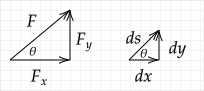

# HW 1

Due on Saturday, September 3rd at 3pm. During class on Thursday, September 1st, I will explain how I would like any code used for your homework assignments turned in.

## 1--D Problems

In class, I showed how to find the electric field and potential between two infinite conducting plates and two long coaxial conducting cylinders when the conductors are held at different potentials. I used two methods:

1. Assume a net charge $\pm Q$ appears on the conductors, use the equation that results from the application of Gauss' law to find the electric field, and then use $\ds V(b)-V(a)=-\int_a^b E dl$ to find the potential.


2. Find the general solution to $\ds \nabla^2V=0$ and use the given conductor potentials to find the potential between the conductors.

Repeat the process I used for the two problems in class for the case of two concentric spheres of radius $a$ and $b$ (with $b > a$) held at potentials of $0$ and $V_o$, respectively. That is, solve for $E$ and $V$ for this problem using the two approaches described above.

## Continuous Charge Distribution Approximation

In E&M, we often assume that point charges are continuously distributed. This problem addresses the accuracy of this approximation.

A line of length $2L$ is centered on the origin and lies between $-L\le x\le L$. The charge density, $\lambda_o$, on the line is uniform.

If the line is approximated by an odd number of point charges (odd number so a charge is always at the origin) separated by a distance $\Delta$ and is used to compute the approximate electric field $E_{ya}$ on the $y$-axis at $y=L$, what $\Delta$ is required so that

$$\left|\frac{E_{ye}(0,L)-E_{ya}(0,L)}{E_{ye}(0,L)}\right|\le 0.01\;?$$

where the exact solution is given by $E_{ye}$. 

You may look up the exact solution, but cite your source. You may use any program or a calculator to solve this problem. Save your program as a file with name <code>HW1_2.ext</code>, where <code>ext</code> is the file extension for your program, e.g., <code>m</code>, <code>py</code>, etc. If you use a spreadsheet, follow the instructions for the following problem.

## Field Lines

Many students have never actually written a program to draw field lines. In doing so, you'll gain a bit of insight into how the field line drawings you see in books are created. In addition, you'll appreciate some of the limitations of field lines. In the development of the theory of electricity and magnetism, the concept of a field line was central. (They were introduced by Faraday and Maxwell referred to and used them extensively.) In addition, the textbook emphasizes field lines and "tubes of flux".

**Background**

Consider a 2-D vector field defined by

$$\mathbf{F} = F_x(x,y)\hat{\mathbf{x}} + F_y(x,y)\hat{\mathbf{y}}$$

A field line is a line that is always tangent to the vector $\mathbf{F}$.  

To determine the equations that must be solved to find the field line, consider a differential distance $ds$ drawn in the direction of $\mathbf{F}$ at a given point. This step has a horizontal component of $dx$ and a vertical component of $dy$.  



The differential triangle is similar to a triangle formed with $a$ $F_x$ in the $x$-direction, $F_y$ in the $y$-direction, and $F$ as the hypotenuse so that

$$\frac{dx}{ds} = \frac{F_x(x,y)}{F(x,y)}$$

$$\frac{dy}{ds} = \frac{F_y(x,y)}{F(x,y)}$$

where $F(x,y)=\sqrt{F_x^2+F_y^2}$.

We have now formulated the statement "a field line is a line that is always tangent to the vector $\mathbf{F}(x,y)$" as a set of two differential equations. The field line corresponds to the solution for $x(s)$ and $y(s)$ and the quantity $s$ corresponds to the length of the field line.

To compute $x(s)$ and $y(s)$, we can solve the above equations in the same way that differential equations for the trajectory of a particle are solved. Using the Forward Euler approximation

$$\frac{dx}{ds} \simeq \frac{x(s+\Delta s)-x(s)}{\Delta s}$$

$$\frac{dy}{ds} \simeq \frac{y(s+\Delta s)-y(s)}{\Delta s}$$

gives

$$x(s+\Delta s) = x(s) + \Delta s\frac{F_x(x(s),y(s))}{F(x(s),y(s))}$$

$$y(s+\Delta s) = y(s) + \Delta s\frac{F_y(x(s),y(s))}{F(x(s),y(s))}$$

To find the field line, we must specify initial positions $x(0)$ and $y(0)$ and also a step size $\Delta s$ and then iterate the above two equations. Discretized, the above two equations are

$$x_{i+1} = x_i + \Delta s\frac{F_x(x_i,y_i)}{F(x_i,y_i)}$$

$$y_{i+1} = y_i + \Delta s\frac{F_y(x_i,y_i)}{F(x_i,y_i)}$$

**Problem**

The electric field caused by a $+q$ charge at $(x',y',z')$ is

$$\mathbf{E}(x,y,z) = kq\frac{(x-x')\hat{\mathbf{x}}+(y-y')\hat{\mathbf{y}}+(z-z')\hat{\mathbf{z}}}{\big[(x-x')^2+(y-y')^2+(z-z')^2\big]^{3/2}}$$

Write a program that draws the field lines in the $x$-$y$ plane for a dipole: $+q$ at $(x,y,z)=(d,0,0)$ and $-q$ at $(x,y,z)=(-d,0,0)$. You may use the Forward Euler method, but I encourage you to use a better algorithm using an existing library (such as MATLAB's <code>ODE45</code> or SciPy's <code>ODEINT</code> or <code>SOLVE_IVP</code>). I have intentionally not specified how many lines to draw or given values for $q$ and $d$.

**Sample Code**

As an example of solving two ODES, in the following, I solve the two equations

$\ds\frac{dx}{dt}=x \qquad \frac{dy}{dt}=-y$

numerically using the Forward Euler approximation. In this approximation, the equations can be rewritten as

$x_{i+1}=x_{i} + \Delta t x_i \qquad y_{i+1}=y_{i} - \Delta t y_i$

I use the parameter $\Delta t = 0.01$, which controls the accuracy of the solution. (Note that the Forward Euler approximation is not a good method for solving ODEs, but it is simple and easy to implement.)

*Spreadsheet*

In this [Spreadsheet](https://docs.google.com/spreadsheets/d/1AL08kI-UhRC2qocJcrxnJI52Ckd4w6jVyTn41J3qY5s/edit?usp=sharing), I solve the two equations using the Forward Euler approximation with $\Delta t = 0.01$.

*MATLAB*

You can access MATLAB using the Citrix Virtual Lab: https://its.gmu.edu/service/citrix-virtual-lab/. Make sure to install the app first. The instructions say it is recommended, but I was not able to get things to work until I installed the app.

```matlab
function ode_demo()

    %% Forward Euler
    dt = 0.01;

    t = 0;
    x(1) = 1;
    y(1) = 1;
    Nsteps = 100;

    fprintf('t\tx\ty\n')
    for i = 1:Nsteps-1
        fprintf('%.1f\t%.1f\t%.1f\n',t(i),x(i),y(i));
        x(i+1) = x(i) + dt*x(i);
        y(i+1) = y(i) - dt*y(i);
        t(i+1) = t(i) + dt;
    end

    plot(x,y);
    hold on;
    xlabel('x')
    ylabel('y')
    title('$dx/dt=x; dy/dt=-y$; x(0)=y(0)=1','Interpreter','Latex');

    %% Runge-Kutta

    function ret = dXdt(t, X)
        % For MATLAB ODE functions, must specify code that computes right-hand
        % side of differential equations. Here we have
        % dx/dt = x
        % dy/dt = -y
        %
        % Defining X = [x, y], in matrix notation
        %   dX/dt = [x; -y]
        ret = [X(1); -X(2)];
    end    

    [t, X] = ode45(@dXdt, [0, 1], [1, 1]);

    plot(X(:,1),X(:,2),'r-');

    legend('Forward Euler', 'Runge-Kutta 4-5');
end
```

Save your as a file with name <code>HW1_1.ext</code>, where <code>ext</code> is the file extension for your program, e.g., <code>m</code>, <code>py</code>, etc. Save a PDF or PNG of your plot and name it <code>HW1_1.png</code> or <code>HW1_1.pdf</code>. If you used a spreadsheet, you do not need to upload an image; instead upload the spreadsheet file (if you used Google Docs, create a file named <code>HW1_1.link</code> and paste the link to your Google Spreadsheet; make sure that your spreadsheet is visible to anyone with the link).

# HW 2

Due Saturday, September 10th at 3pm.

## 1--D 

A large conducting plate in the $x=0$ plane is grounded. A large conducting plate in the $x=d$ plane is held at $V_o$. In the $x=x'$ plane ($0<x'<d$), there is a large uniformly charged sheet.

1. Find the potential.
2. Find the surface charge densities on each conductor and the sum of the surface charge densities on the three surfaces.
3. If, instead of a charged sheet, a large thick slab fills the space between $0 < x < d/2$, find the potential.

**Answers**

1. If both plates are grounded, 

   $\displaystyle\psi_l=\frac{\sigma'}{\epsilon_o}\left(1-\frac{x'}{w}\right)x$
   
   $\displaystyle\psi_r=\frac{\sigma'}{\epsilon_o}\left(1-\frac{x}{w}\right)x'$

   If right plate is at $V_o$, we need to add $V_ox/d$ to both.

2. $\sigma_l=\epsilon_o\mathbf{E}\bfcdot\hat{\mathbf{n}}$ with $\hat{\mathbf{n}}=\xhat$ on plate at $x=0$ and $\hat{\mathbf{n}}=-\xhat$ on plate at $x=d$. Using $E=-d\psi/dx$ gives

   $\sigma_l=$
   
   $\sigma_r=$

3. If both plates are grounded

   $$\psi_l(x)=-\frac{1}{2}\frac{\rho}{\epsilon_o}x^2+\frac{3}{8}\frac{\rho d}{\epsilon_o}x$$

   $$\psi_r(x)=\frac{1}{8}\frac{\rho d}{\epsilon_o} (d-x)$$

   If right plate is at $V_o$, we need to add $V_ox/d$ to both.

## Continuous Charge Distributions

1. Use Gauss' law to compute the electric field near the center and just above or below the surface of a finite square of charge of side length $w$ and charge density $\sigma_o$.

   **Answer**: See any intro textbook.

2. Show how the exact answer

   $$E_z(z)=\frac{\sigma_o}{\pi \epsilon_o}\tan^{-1}\left[\frac{w^2}{4z}\frac{1}{\sqrt{z^2+w^2/2}}\right]$$

   matches the Gauss' law result when $z/w \ll 1$.

   **Answer**: For $z\ll w$, the argument to the inverse tangent is

   $$\frac{w^2}{4z}\frac{1}{\sqrt{z^2+w^2/2}}\simeq \frac{w}{z}\frac{\sqrt{2}}{4}$$

   so for $z \gt 0$ and $z\ll w$

   $$E_z(z)\rightarrow\frac{\sigma_o}{\pi\epsilon_o}\tan^{-1}(+\infty) = \frac{\sigma_o}{2\epsilon_o}$$

   For $z \lt 0$ and $z\ll w$

   $$E_z(z)\rightarrow\frac{\sigma_o}{\pi\epsilon_o}\tan^{-1}(-\infty) = -\frac{\sigma_o}{2\epsilon_o}$$

   and so the solution matches that for an infinite sheet of charge. Another problem one could ask is to show that for $z\gg w$, $E_z\rightarrow k\sigma_ow^2/z^2$ (far away, the sheet of charge appears as a charge $\sigma_ow^2$ at the origin). To show this, one would need to Taylor series expand the argument of the inverse tangent for small $w/z$.

## Laplace' Equation in Two Dimensions -- Numerical

1. Verify the numbers in the Step 1 column of Table 1.20 of the textbook. Show your calculations on a piece of paper. (In class, we will start the development of a program to compute the potentials in the other columns.)
2. Find the equation for the exact potential for this problem if all of the sides are set to have zero potential except the side at $80\text{ V}$. Ideally you would derive the equation, but if you are not able to, cite your source.

# HW 3

Due Saturday, September 17th at 3 pm.

## Laplace' Equation in 1--D Spherical -- Numerical

In Section 1.20 of the texbook, a derivation is given for a numerical algorithm for solving Laplace's equation in 2--D cartesian.

1. Use similar steps to derive an algorithm for solving numerically solving Laplace's equation in 1--D spherical, which is

    $$
    \nabla^2\Phi(r)=
    {1 \over r^{2}}{\partial \over \partial r}\left(r^{2}{\partial \Phi \over \partial r}\right)=0
    $$

    If $r\ne 0$, then

    $$
    \nabla^2\Phi=
    {\partial \over \partial r}\left(r^{2}{\partial \Phi \over \partial r}\right)=0
    $$
    
    Using the product rule, we can write 
    
    $$
    \nabla^2\Phi=
    2r{\partial \Phi \over \partial r} + r^{2}{\partial^2 \Phi \over \partial r^2}=0
    $$
    
2. If $\Phi(r=2)=1$ and $\Phi(r=1)=0$, use your algorithm from 1. to find the potential at $r=1.5$. (Use a grid with points at $r=1$, $r=1.5$, and $r=2$.)
3. Repeat 2. using a grid with points at $r=1$, $r=4/3$, $r=5/3$, and $r=2$.

Save your solution as `HW3_1.pdf` and upload to your repository.

## Interpretation of Bound Surface Charges

In Example 4.3 of Griffiths 4th Edition, he models a polarized sphere by using two uniformly charged spheres with centers that are separated by a small distance $d$. The potential found is the same as that found in Example 4.2 found by computing the bound surface charge density for a sphere with polarization $\mathbf{P}=P_o\zhat$.

In this problem, a polarized slab will be modeled using two slabs of charge with uniform and opposite charge density that are offset by a small distance $d$.

1. Find $\mathbf{E}(y)$ for the slab with uniform charge density $\rho_o$ shown in the following figure. Assume that the slab is infinite in extent in the $\pm z$ and $\pm x$ directions so that Gauss's law can be used. (This slab can be thought of as being composed of thin sheets of charge stacked together and so an alternative to using Gauss's law is to sum the electric field due to sheets of charge.)

   

2. Plot $\mathbf{E}(y)$ vs $y$.

3. Next, compute and plot $\mathbf{E}(y)$ for the same slab if it had charge density of $-\rho_o$ and was shifted by $-d$ in the $y$--direction. Assume that $d\ll t$.

4. Compute $\mathbf{E}$ in the region of overlap of the $+\rho_o$ and $-\rho_o$ slabs.

Save your solution as `HW3_2.pdf` and upload to your repository. If you use code, save it as `HW3_2.ext`, where `ext` is the program extension (e.g., `m`, `py`, etc.).

# HW 4

Due Saturday, September 24th at 6 pm.

## Capactor with Dielectrics -- Analytical

A large parallel plate capacitor is half--filled with two linear dielectrics with permittivities of $\epsilon_1$ and $\epsilon_2$. Assume that the capacitor is large enough that the potential only varies in the $x$--direction. In the diagram, the dotted rectangle is the cross--section of a Gaussian cylinder referenced in parts 4. and 5.


1. Solve $\nabla^2 V$ in each dielectric using $V_1(0)=0$, $V_2(2d)=V_o$, $V_1(d)=V_2(d)$ and $D_1(d)=D_2(d)$.
2. Verify that when $\epsilon_1=\epsilon_2$, the answer is as expected from a problem solved previously in class.
3. Write the potential from 1. for $\chi_{e2}\rightarrow \infty$ and show that it is the same as if dielectric 2 was replaced with a conductor.

Using your answer to 1.,

3. use $\sigma_b=\mathbf{P}\bfcdot\hat{\mathbf{n}}$ to find the four bound surface charge densities (that is, the bound charge density on the left and right surfaces on both dielectrics);
4. show that Gauss's law $\oint \mathbf{E}\bfcdot d\mathbf{a}=\sigma/\epsilon_o$ is satisfied for the Gaussian cylinder shown on the diagram ($\sigma$ in this equation is all charges: bound and free); and
5. show that Gauss's law for dielectrics, $\oint \mathbf{D}\bfcdot d\mathbf{a}=\sigma_{\text {free}}$ is satisfied for the Gaussian cylinder shown on the diagram ($\sigma_{\text {free}}$ in this equation is all non--bound charges).

Save your answer in a file named `HW4_1.pdf`.

## Capactor with Dielectrics -- Numerical

Find a numerical approximation of the (1--D) potential for the previous problem. Do this using the "Simple Averaging Method" described in Example 1.20 of the textbook. Use grid points at $x=0, d/2, d, 3d/2$, and $2d$. You only need to find the approximation using one step of the simple averaging method.

Hint: For any grid point that is not at $x=d$, the potential is simply the average of the potentials to the left and right. For a grid point at $x=d$, you will need to find an equation that numerically implements the condition $D_1(d)=D_2(d)$. If your grid points are at $x=0, d$, and $2d$, the only equation that you will solve is the equation for the condition $D_1(d)=D_2(d)$. Try this version of the problem first. Does it give a sensible result when $\chi_{e2}\rightarrow \infty$ or if $\epsilon_1=\epsilon_2$?

Save your derivation and numerical values for the potential in a file named `HW4_2.pdf` and any code as `HW4_2.ext`, where ext is the file name extension for the language, e.g., `m` or `py`.

# HW 5

The background for this homework is covered in Chapter 2 of the texbook and Chapter 4 of Griffiths. Ramo starts off with $\mathbf{H}$ instead of $\mathbf{B}$.

Due Saturday, October 1st at 3:00 pm.

## Force on electrons in a wire

Solve problem 2.2a of Ramo

Save your answer in a file named `HW5_1.pdf`.

## The Hall effect

Solve problem 2.2b of Ramo

Save your answer in a file named `HW5_2.pdf`.

## Axial current on a long coaxial cable

Solve problem 2.2c of Ramo

Save your answer in a file named `HW5_3.pdf`.

## Inductance

Find the inductance per unit length of an infinitely long solenoid of radius $a$. Do this

1. using formula (1) of section 2.5 and
2. formula (1) of section 2.16 of the textbook.

Assume $\mu=\mu_o$.

Save your answer in a file named `HW5_4.pdf`.
