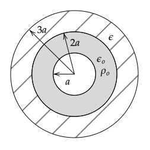

# HW 1

Due on Saturday, September 3rd at 3pm. During class on Thursday, September 1st, I will explain how I would like any code used for your homework assignments turned in.

## 1--D Problems

In class, I showed how to find the electric field and potential between two infinite conducting plates and two long coaxial conducting cylinders when the conductors are held at different potentials. I used two methods:

1. Assume a net charge $\pm Q$ appears on the conductors, use the equation that results from the application of Gauss' law to find the electric field, and then use $\ds V(b)-V(a)=-\int_a^b E dl$ to find the potential.


2. Find the general solution to $\ds \nabla^2V=0$ and use the given conductor potentials to find the potential between the conductors.

Repeat the process I used for the two problems in class for the case of two concentric spheres of radius $a$ and $b$ (with $b > a$) held at potentials of $0$ and $V_o$, respectively. That is, solve for $E$ and $V$ for this problem using the two approaches described above.

**Answer**: Covered in class

## Continuous Charge Distribution Approximation

In E&M, we often assume that point charges are continuously distributed. This problem addresses the accuracy of this approximation.

A line of length $2L$ is centered on the origin and lies between $-L\le x\le L$. The charge density, $\lambda_o$, on the line is uniform.

If the line is approximated by an odd number of point charges (odd number so a charge is always at the origin) separated by a distance $\Delta$ and is used to compute the approximate electric field $E_{ya}$ on the $y$-axis at $y=L$, what $\Delta$ is required so that

$$\left|\frac{E_{ye}(0,L)-E_{ya}(0,L)}{E_{ye}(0,L)}\right|\le 0.01\;?$$

where the exact solution is given by $E_{ye}$. 

You may look up the exact solution, but cite your source. You may use any program or a calculator to solve this problem. Save your program as a file with name <code>HW1_2.ext</code>, where <code>ext</code> is the file extension for your program, e.g., <code>m</code>, <code>py</code>, etc. If you use a spreadsheet, follow the instructions for the following problem.

**Answer**: 51

## Field Lines

Many students have never actually written a program to draw field lines. In doing so, you'll gain a bit of insight into how the field line drawings you see in books are created. In addition, you'll appreciate some of the limitations of field lines. In the development of the theory of electricity and magnetism, the concept of a field line was central. (They were introduced by Faraday and Maxwell referred to and used them extensively.) In addition, the textbook emphasizes field lines and "tubes of flux".

**Background**

Consider a 2-D vector field defined by

$$\mathbf{F} = F_x(x,y)\hat{\mathbf{x}} + F_y(x,y)\hat{\mathbf{y}}$$

A field line is a line that is always tangent to the vector $\mathbf{F}$.  

To determine the equations that must be solved to find the field line, consider a differential distance $ds$ drawn in the direction of $\mathbf{F}$ at a given point. This step has a horizontal component of $dx$ and a vertical component of $dy$.  


The differential triangle is similar to a triangle formed with $a$ $F_x$ in the $x$-direction, $F_y$ in the $y$-direction, and $F$ as the hypotenuse so that

$$\frac{dx}{ds} = \frac{F_x(x,y)}{F(x,y)}$$

$$\frac{dy}{ds} = \frac{F_y(x,y)}{F(x,y)}$$

where $F(x,y)=\sqrt{F_x^2+F_y^2}$.

We have now formulated the statement "a field line is a line that is always tangent to the vector $\mathbf{F}(x,y)$" as a set of two differential equations. The field line corresponds to the solution for $x(s)$ and $y(s)$ and the quantity $s$ corresponds to the length of the field line.

To compute $x(s)$ and $y(s)$, we can solve the above equations in the same way that differential equations for the trajectory of a particle are solved. Using the Forward Euler approximation

$$\frac{dx}{ds} \simeq \frac{x(s+\Delta s)-x(s)}{\Delta s}$$

$$\frac{dy}{ds} \simeq \frac{y(s+\Delta s)-y(s)}{\Delta s}$$

gives

$$x(s+\Delta s) = x(s) + \Delta s\frac{F_x(x(s),y(s))}{F(x(s),y(s))}$$

$$y(s+\Delta s) = y(s) + \Delta s\frac{F_y(x(s),y(s))}{F(x(s),y(s))}$$

To find the field line, we must specify initial positions $x(0)$ and $y(0)$ and also a step size $\Delta s$ and then iterate the above two equations. Discretized, the above two equations are

$$x_{i+1} = x_i + \Delta s\frac{F_x(x_i,y_i)}{F(x_i,y_i)}$$

$$y_{i+1} = y_i + \Delta s\frac{F_y(x_i,y_i)}{F(x_i,y_i)}$$

**Problem**

The electric field caused by a $+q$ charge at $(x',y',z')$ is

$$\mathbf{E}(x,y,z) = kq\frac{(x-x')\hat{\mathbf{x}}+(y-y')\hat{\mathbf{y}}+(z-z')\hat{\mathbf{z}}}{\big[(x-x')^2+(y-y')^2+(z-z')^2\big]^{3/2}}$$

Write a program that draws the field lines in the $x$-$y$ plane for a dipole: $+q$ at $(x,y,z)=(d,0,0)$ and $-q$ at $(x,y,z)=(-d,0,0)$. You may use the Forward Euler method, but I encourage you to use a better algorithm using an existing library (such as MATLAB's <code>ODE45</code> or SciPy's <code>ODEINT</code> or <code>SOLVE_IVP</code>). I have intentionally not specified how many lines to draw or given values for $q$ and $d$.

**Sample Code**

As an example of solving two ODES, in the following, I solve the two equations

$\ds\frac{dx}{dt}=x \qquad \frac{dy}{dt}=-y$

numerically using the Forward Euler approximation. In this approximation, the equations can be rewritten as

$x_{i+1}=x_{i} + \Delta t x_i \qquad y_{i+1}=y_{i} - \Delta t y_i$

I use the parameter $\Delta t = 0.01$, which controls the accuracy of the solution. (Note that the Forward Euler approximation is not a good method for solving ODEs, but it is simple and easy to implement.)

*Spreadsheet*

In this [Spreadsheet](https://docs.google.com/spreadsheets/d/1AL08kI-UhRC2qocJcrxnJI52Ckd4w6jVyTn41J3qY5s/edit?usp=sharing), I solve the two equations using the Forward Euler approximation with $\Delta t = 0.01$.

*MATLAB*

You can access MATLAB using the Citrix Virtual Lab: https://its.gmu.edu/service/citrix-virtual-lab/. Make sure to install the app first. The instructions say it is recommended, but I was not able to get things to work until I installed the app.

```matlab
function ode_demo()

    %% Forward Euler
    dt = 0.01;

    t = 0;
    x(1) = 1;
    y(1) = 1;
    Nsteps = 100;

    fprintf('t\tx\ty\n')
    for i = 1:Nsteps-1
        fprintf('%.1f\t%.1f\t%.1f\n',t(i),x(i),y(i));
        x(i+1) = x(i) + dt*x(i);
        y(i+1) = y(i) - dt*y(i);
        t(i+1) = t(i) + dt;
    end

    plot(x,y);
    hold on;
    xlabel('x')
    ylabel('y')
    title('$dx/dt=x; dy/dt=-y$; x(0)=y(0)=1','Interpreter','Latex');

    %% Runge-Kutta

    function ret = dXdt(t, X)
        % For MATLAB ODE functions, must specify code that computes right-hand
        % side of differential equations. Here we have
        % dx/dt = x
        % dy/dt = -y
        %
        % Defining X = [x, y], in matrix notation
        %   dX/dt = [x; -y]
        ret = [X(1); -X(2)];
    end    

    [t, X] = ode45(@dXdt, [0, 1], [1, 1]);

    plot(X(:,1),X(:,2),'r-');

    legend('Forward Euler', 'Runge-Kutta 4-5');
end
```

Save your as a file with name <code>HW1_1.ext</code>, where <code>ext</code> is the file extension for your program, e.g., <code>m</code>, <code>py</code>, etc. Save a PDF or PNG of your plot and name it <code>HW1_1.png</code> or <code>HW1_1.pdf</code>. If you used a spreadsheet, you do not need to upload an image; instead upload the spreadsheet file (if you used Google Docs, create a file named <code>HW1_1.link</code> and paste the link to your Google Spreadsheet; make sure that your spreadsheet is visible to anyone with the link).

# HW 2

Due Saturday, September 10th at 3pm.

## 1--D 

A large conducting plate in the $x=0$ plane is grounded. A large conducting plate in the $x=d$ plane is held at $V_o$. In the $x=x'$ plane ($0<x'<d$), there is a large uniformly charged sheet.

1. Find the potential.
2. Find the surface charge densities on each conductor and the sum of the surface charge densities on the three surfaces.
3. If, instead of a charged sheet, a large thick slab fills the space between $0 < x < d/2$, find the potential.

**Answers**

1. If both plates are grounded, 

   $\displaystyle\psi_l=\frac{\sigma'}{\epsilon_o}\left(1-\frac{x'}{w}\right)x$
   
   $\displaystyle\psi_r=\frac{\sigma'}{\epsilon_o}\left(1-\frac{x}{w}\right)x'$

   If right plate is at $V_o$, we need to add $V_ox/d$ to both.

2. $\sigma_l=\epsilon_o\mathbf{E}\bfcdot\hat{\mathbf{n}}$ with $\hat{\mathbf{n}}=\xhat$ on plate at $x=0$ and $\hat{\mathbf{n}}=-\xhat$ on plate at $x=d$, and $E=-d\psi/dx$. The sum should be zero because a Gaussian cylinder with end caps in the conductors will have zero flux and so should have zero enclosed charge.

3. If both plates are grounded

   $$\psi_l(x)=-\frac{1}{2}\frac{\rho}{\epsilon_o}x^2+\frac{3}{8}\frac{\rho d}{\epsilon_o}x$$

   $$\psi_r(x)=\frac{1}{8}\frac{\rho d}{\epsilon_o} (d-x)$$

   If right plate is at $V_o$, we need to add $V_ox/d$ to both.

## Continuous Charge Distributions

1. Use Gauss' law to compute the electric field near the center and just above or below the surface of a finite square of charge of side length $w$ and charge density $\sigma_o$.

   **Answer**: See any intro textbook.

2. Show how the exact answer

   $$E_z(z)=\frac{\sigma_o}{\pi \epsilon_o}\tan^{-1}\left[\frac{w^2}{4z}\frac{1}{\sqrt{z^2+w^2/2}}\right]$$

   matches the Gauss' law result when $z/w \ll 1$.

   **Answer**: For $z\ll w$, the argument to the inverse tangent is

   $$\frac{w^2}{4z}\frac{1}{\sqrt{z^2+w^2/2}}\simeq \frac{w}{z}\frac{\sqrt{2}}{4}$$

   so for $z \gt 0$ and $z\ll w$

   $$E_z(z)\rightarrow\frac{\sigma_o}{\pi\epsilon_o}\tan^{-1}(+\infty) = \frac{\sigma_o}{2\epsilon_o}$$

   For $z \lt 0$ and $z\ll w$

   $$E_z(z)\rightarrow\frac{\sigma_o}{\pi\epsilon_o}\tan^{-1}(-\infty) = -\frac{\sigma_o}{2\epsilon_o}$$

   and so the solution matches that for an infinite sheet of charge. Another problem one could ask is to show that for $z\gg w$, $E_z\rightarrow k\sigma_ow^2/z^2$ (far away, the sheet of charge appears as a charge $\sigma_ow^2$ at the origin). To show this, one would need to Taylor series expand the argument of the inverse tangent for small $w/z$.

## Laplace' Equation in Two Dimensions -- Numerical

1. Verify the numbers in the Step 1 column of Table 1.20 of the textbook. Show your calculations on a piece of paper. (In class, we will start the development of a program to compute the potentials in the other columns.)
2. Find the equation for the exact potential for this problem if all of the sides are set to have zero potential except the side at $80\text{ V}$. Ideally you would derive the equation, but if you are not able to, cite your source.

**Answers** Covered in class.

# HW 3

Due Saturday, September 17th at 3 pm.

## Laplace' Equation in 1--D Spherical -- Numerical

In Section 1.20 of the texbook, a derivation is given for a numerical algorithm for solving Laplace's equation in 2--D cartesian.

1. Use similar steps to derive an algorithm for solving numerically solving Laplace's equation in 1--D spherical, which is

    $$
    \nabla^2\Phi(r)=
    {1 \over r^{2}}{\partial \over \partial r}\left(r^{2}{\partial \Phi \over \partial r}\right)=0
    $$

    If $r\ne 0$, then

    $$
    \nabla^2\Phi=
    {\partial \over \partial r}\left(r^{2}{\partial \Phi \over \partial r}\right)=0
    $$
    
    Using the product rule, we can write 
    
    $$
    \nabla^2\Phi=
    2r{\partial \Phi \over \partial r} + r^{2}{\partial^2 \Phi \over \partial r^2}=0
    $$
    
2. If $\Phi(r=2)=1$ and $\Phi(r=1)=0$, use your algorithm from 1. to find the potential at $r=1.5$. (Use a grid with points at $r=1$, $r=1.5$, and $r=2$.)
3. Repeat 2. using a grid with points at $r=1$, $r=4/3$, $r=5/3$, and $r=2$.

Save your solution as `HW3_1.pdf` and upload to your repository.

## Interpretation of Bound Surface Charges

In Example 4.3 of Griffiths 4th Edition, he models a polarized sphere by using two uniformly charged spheres with centers that are separated by a small distance $d$. The potential found is the same as that found in Example 4.2 found by computing the bound surface charge density for a sphere with polarization $\mathbf{P}=P_o\zhat$.

In this problem, a polarized slab will be modeled using two slabs of charge with uniform and opposite charge density that are offset by a small distance $d$.

1. Find $\mathbf{E}(y)$ for the slab with uniform charge density $\rho_o$ shown in the following figure. Assume that the slab is infinite in extent in the $\pm z$ and $\pm x$ directions so that Gauss's law can be used. (This slab can be thought of as being composed of thin sheets of charge stacked together and so an alternative to using Gauss's law is to sum the electric field due to sheets of charge.)

   

2. Plot $\mathbf{E}(y)$ vs $y$.

3. Next, compute and plot $\mathbf{E}(y)$ for the same slab if it had charge density of $-\rho_o$ and was shifted by $-d$ in the $y$--direction. Assume that $d\ll t$.

4. Compute $\mathbf{E}$ in the region of overlap of the $+\rho_o$ and $-\rho_o$ slabs.

Save your solution as `HW3_2.pdf` and upload to your repository. If you use code, save it as `HW3_2.ext`, where `ext` is the program extension (e.g., `m`, `py`, etc.).

# HW 4

Due Saturday, September 24th at 6 pm.

## Capactor with Dielectrics -- Analytical

A large parallel plate capacitor is half--filled with two linear dielectrics with permittivities of $\epsilon_1$ and $\epsilon_2$. Assume that the capacitor is large enough that the potential only varies in the $x$--direction. In the diagram, the dotted rectangle is the cross--section of a Gaussian cylinder referenced in parts 4. and 5.


1. Solve $\nabla^2 V$ in each dielectric using $V_1(0)=0$, $V_2(2d)=V_o$, $V_1(d)=V_2(d)$ and $D_1(d)=D_2(d)$.
2. Verify that when $\epsilon_1=\epsilon_2$, the answer is as expected from a problem solved previously in class.
3. Write the potential from 1. for $\chi_{e2}\rightarrow \infty$ and show that it is the same as if dielectric 2 was replaced with a conductor.

Using your answer to 1.,

3. use $\sigma_b=\mathbf{P}\bfcdot\hat{\mathbf{n}}$ to find the four bound surface charge densities (that is, the bound charge density on the left and right surfaces on both dielectrics);
4. show that Gauss's law $\oint \mathbf{E}\bfcdot d\mathbf{a}=\sigma/\epsilon_o$ is satisfied for the Gaussian cylinder shown on the diagram ($\sigma$ in this equation is all charges: bound and free); and
5. show that Gauss's law for dielectrics, $\oint \mathbf{D}\bfcdot d\mathbf{a}=\sigma_{\text {free}}$ is satisfied for the Gaussian cylinder shown on the diagram ($\sigma_{\text {free}}$ in this equation is all non--bound charges).

Save your answer in a file named `HW4_1.pdf`.

## Capactor with Dielectrics -- Numerical

Find a numerical approximation of the (1--D) potential for the previous problem. Do this using the "Simple Averaging Method" described in Example 1.20 of the textbook. Use grid points at $x=0, d/2, d, 3d/2$, and $2d$. You only need to find the approximation using one step of the simple averaging method.

Hint: For any grid point that is not at $x=d$, the potential is simply the average of the potentials to the left and right. For a grid point at $x=d$, you will need to find an equation that numerically implements the condition $D_1(d)=D_2(d)$. If your grid points are at $x=0, d$, and $2d$, the only equation that you will solve is the equation for the condition $D_1(d)=D_2(d)$. Try this version of the problem first. Does it give a sensible result when $\chi_{e2}\rightarrow \infty$ or if $\epsilon_1=\epsilon_2$?

Save your derivation and numerical values for the potential in a file named `HW4_2.pdf` and any code as `HW4_2.ext`, where ext is the file name extension for the language, e.g., `m` or `py`.

# HW 5

The background for this homework is covered in Chapter 2 of the texbook and Chapter 4 of Griffiths.

Due Saturday, October 1st at 3:00 pm.

## Force on electrons in a wire

Solve problem 2.2a of Ramo

Save your answer in a file named `HW5_1.pdf`.

## The Hall effect

Solve problem 2.2b of Ramo

Save your answer in a file named `HW5_2.pdf`.

## Axial current on a long coaxial cable

Solve problem ~2.2c~ 2.4a of Ramo

Save your answer in a file named `HW5_3.pdf`.

## Inductance

Find the inductance per unit length of an infinitely long solenoid of radius $a$. Do this

1. using formula (1) of section 2.5 and
2. formula (1) of section 2.16 of the textbook.

Assume $\mu=\mu_o$.

Save your answer in a file named `HW5_4.pdf`.

# HW 6

Due on Saturday, October 8th at 3 pm. Save the answers to the written parts as `HW6_1.pdf`, `HW6_2.pdf`, and `HW6_3.pdf`.

## Computing Magnetic Field and Flux

1. Write a function that returns the magnetic field computed using a discrete approximation to the Biot-Savart integral. The inputs to the function should be a 3-D location in space, an arbitrary number of 3-D points on a wire, and the current in the wire. Assume that the given points on the wire are connected by straight wire segments of length \(L\) and treat these segments as the differential lengths in the Biot-Savart integrand. That is, the magnetic field for each segment \(i\) should be computed as

   $$
   \mathbf{B}_i = \frac{\mu_oI}{4\pi}\frac{\mathbf{L}_i\times \mathbf{R}_i}{R_i^3}
   $$
   
   where the notation is that used on page 74 of the textbook. As an example, in MATLAB notation, I should be able to call your function as in the following script

   ```matlab
   p = [0, 0, 0];
   % Each row of XYZ is a point on a wire.
   XYZ = [1,  1, 0;
         -1,  1, 0;
         -1, -1, 0;
          1, -1, 0];

   I = 1;
 
   B = HW4_BiotSavart(p, XYZ, I)

   % B is an array with three elements corresponding to Bx, By, and Bz at
   (x, y, z) = (0, 0, 0)
   ``` 

Name the function ```HW6_BiotSavart``` and save it in a file named ```HW6_BiotSavart.ext```. 

2. You want to convince me that your program is correctly implementing the Biot-Savart formula and can be used to approximate the magnetic field for an arbitrarily shaped wire provided that enough points on the wire are given. Create a script named ```HW6_Check.ext``` that generates tables and/or plots that make the case.

3. Consider two circular current loops of radius 1 m. One is centered on the origin, carries a current of 1 A, and lies in the $z=0$ plane. The other is in the $z=2$ m plane and the $z$-axis passes through its center. Compute the magnetic flux through the shifted current loop using the function created in part 1. Create a script named ```HW4_Flux.ext``` that prints the magnetic flux.

In class, I will ask you to give a brief summary of your solution.

**Answer**

My code is located at https://github.com/rweigel/phys513/tree/master/hw (files with names that start with `HW4`).

I looked up the [analytic answer](http://www.netdenizen.com/emagnet/offaxis/iloopoffaxis.htm) for the off-axis magnetic field of a circular current loop . The off-axis field requires an integration of an elliptic integral.

To compute the flux, I considered the integral that I would set up to compute the exact answer. To do this, I need $B_z(s_i,0,z)$ at $z=2$ and $s=ds, 2ds, ..., 1$. The flux through an annulus of radius $s_i$ with width $ds$ is then

$$\Phi_M^i = 2\pi s_i ds B_z(s_i)$$

As the number of annuli increases, the flux should approach the exact answer. This is how one would compute the flux using ordinary integration.

## Inductance of a Rectangular Duct

A rectangular duct carries a net current of $I_1 = K_1l$ in the direction shown. A series of current supplies along the infinitesimal gap is driving the current. The duct has a small enough thickness that the current can be treated as flowing on a sheet.


1. Assuming $w \gg h_1$ and $l \gg h_1$, use Ampere's law to find the magnetic field inside and outside of the duct. Show the Amperian loop and justify your steps.

2. The duct has only an external self-inductance. (External inductance means inductance due to flux through a cross-section where there is no current.) The external self-inductance is due to the magnetic flux through the cross-sectional area $A_1=h_1w$. The electromotive force across the gap is due to a change in magnetic flux

   $$\mathcal{E}_1 = -\frac{\partial \Phi_m}{\partial t}$$

   where $\Phi_m$ is the magnetic flux. Compute this magnetic flux and re-write this equation in the form of

   $$\mathcal{E_1} = -L_1 \frac{\partial I_1}{\partial t}$$

   so as to find $L_1$ in terms of $\mu_o$, $l$, and the cross-sectional area $A_1=h_1w$. 

3. Show that the $L_1$ computed in 2. is the same as that using the methods of HW 5.4

## Faraday's Law and Ampere's Law

Faraday's law in integral form in terms of magnetic flux $\Phi_B$ is

$$
\oint\mathbf{E}\cdot d\mathbf{l} = -\frac{\partial \Phi_B}{\partial t}
$$

The generalized form of Ampere's law (see sections 3.4 and 3.5 of the textbook) when $\mathbf{J}=0$ in terms of the electric flux $\Phi_E$ is

$$
\oint\mathbf{B}\cdot d\mathbf{l} = {1\over c^2}\frac{\partial \Phi_E}{\partial t}
$$

On the following diagram, two rectangles labeled e. and b. are shown. In this region of space, the electric field was measured to be $\mathbf{E}=E_{ox}\cos(k_zz-\omega t)\hat{\mathbf{x}}$


1. Find the magnetic field $\mathbf{B}$ that must exist using $\boldsymbol{\nabla}\times \mathbf{E}=-{\partial \mathbf{B}}/{\partial t}$.

2. Show that $\mathbf{E}$ satisfies Faraday's law in the form given above when the path of integration is along rectangle $e$. Draw the path of integration that you used.

3. Show that this $\mathbf{B}$ satisfies Ampere's law in the form given above when the path of integration is along rectangle $b$. Draw the path of integration that you used.

# HW 7

## Plane Wave Incident on Conductor

Read 3.14--3.17 of the textbook.

The program `fdtd1d.m` in the fdtd directory at https://github.com/rweigel/phys513/ uses the Finite Difference Time Domain method to solve the equations

$$\boldsymbol{\nabla}\times \mathbf{E} = -\frac{\partial\mathbf{B}}{\partial t}$$

$$\boldsymbol{\nabla}\times \mathbf{H} = \sigma_c\mathbf{E}+\frac{\partial\mathbf{D}}{\partial t}$$

for the case where $\mathbf{E}=E_y(x,t)\hat{\mathbf{y}}$ and $\mathbf{H}=H_z(x,t)\hat{\mathbf{y}}$. (This code was based on `fdtd1d_original.m` and I made several modifications and generalizations.)

In Section 3.16 of the textbook, the analytical solution is given for the case where the ${\partial\mathbf{D}}/{\partial t}$ is omitted.

Imagine that you are given this program and are asked to determine how well the numerical solution matches the theoretical (and approximate) solution for the problem where the electric field is known at the surface of an infinite slab with constant conductivity and the displacement term is ignored.

Come up with at least three ways of comparing the theoretical result with the numerical result. Create three plots that show a line associated with one of the equations given in Section 3.16 versus the output of the simulation. Keep in mind that both the theoretical solution and the numerical solution are approximate.

Clearly label your plots. Upload your plots to your GitHub account and label them <code>HW7_1_1.pdf</code>, <code>HW7_1_2.pdf</code>, and <code>HW7_1_3.pdf</code>. I will show these plots during class and ask you to provide an interpretation.

For now, you do not need to explain the features outside of the conducting region. This is covered in Chapter 5. You also do not need to understand the details of how the simulation is performed. Instead, treat it as a black box from which measurements are extracted.

## Textbook Problems

Solve problems 4.3b, 4.3c, 4.3d., and 4.6e.

Save your answers in a single file named <code>HW7_2.pdf</code>.

# HW 8

## Wave Superposition

An antenna can create a plane wave in the form

$$E_x=A\cos(\omega t-kx+\delta)$$

where $A$ and $\delta$ are adjustable.

By trial-and-error, it is found that two antenna can create a desired signal for certain settings of $A$ and $\delta$ on each. By superposition, the plane wave can be written as

$$E_x=A_1\cos(\omega t-kx+\delta_1) + A_2\cos(\omega t-kx+\delta_2)$$

It is desired to create this plane wave with one antenna, that is,

$$E_x=A_3\cos(\omega t-kx+\delta_3)$$

If possible, what should the values of $A_3$ and $\delta_3$ be in terms of $A_1$, $A_2$, $\delta_1$ and $\delta_2$ in order to create the same same waveform as the two antenna?

## Wave Equation Derivation

If $\mathbf{E}=E_{ox}(x,t)\hat{\mathbf{x}}+E_{oy}(x,t)\hat{\mathbf{y}}+E_{oz}(x,t)\hat{\mathbf{z}}$ and $\mathbf{B}=B_{ox}(x,t)\hat{\mathbf{x}}+B_{oy}(x,t)\hat{\mathbf{y}}+B_{oz}(x,t)\hat{\mathbf{z}}$, show that

1. $E_y(x,t)$, $E_z(x,t)$, $B_y(x,t)$, and $B_z(x,t)$ each individually obey a wave equation of the form

   $${\partial ^2 f\over \partial u^2} = {1 \over c^2}{\partial ^2 f\over \partial t^2}$$

   where $u$ is a placeholder for one of the cartesian variables and $f$ is any one of $E_y(x,t)$, $E_z(x,t)$, $B_y(x,t)$, and $B_z(x,t)$. 

2. Does it follow that $E_x(x,t)=B_x(x,t)=0$? Justify your answer.

3. Show explicitly how your answer to 1. is consistent with

  $$\boldsymbol \nabla^2 \mathbf{E} = {1 \over c^2}{\partial ^2 \mathbf{E}\over \partial t^2}\qquad\boldsymbol \nabla^2 \mathbf{B} = {1 \over c^2}{\partial ^2 \mathbf{B}\over \partial t^2}$$

  Provide a very brief justification for each step used to show this.

## Wave Equation Solutions

1. Show that 

   $$\mathbf{E}=E_{ox}\cos(k_zz-\omega t + \delta_x)\hat{\mathbf{x}}$$

   satisfies

   $$\boldsymbol \nabla^2 \mathbf{E} = {1 \over c^2}{\partial ^2 \mathbf{E}\over \partial t^2}$$

   and

   $$\mathbf{B}=B_{ox}\cos(k\_zz-\omega t + \delta'\_x)\hat{\mathbf{x}}+B_{oy}\cos(k\_zz-\omega t + \delta'\_y)\hat{\mathbf{y}}$$

   satisfies

   $$\boldsymbol \nabla^2 \mathbf{B} = {1 \over c^2}{\partial ^2 \mathbf{B}\over \partial t^2}$$

   Provided that one or more of the constants $k_z$, $\omega$, $E_{ox}$, $B_{ox}$, $B_{oy}$, $\delta_x$, $\delta'_x$, and $\delta'_y$ are related. State the required relationships.

2. Show that one or more of the constants $k_z$, $\omega$, $E_{ox}$, $B_{ox}$, $B_{oy}$, $\delta_x$, $\delta'_x$, and $\delta'_y$ must be either related to each other or zero in order for the both $\mathbf{B}$ and $\mathbf{E}$ given above to be consistent with Maxwell's equations.

3. If $\mathbf{E}$ is instead given by (the $\hat{\mathbf{x}}$ below should be $\hat{\mathbf{y}}$. If you have not started this problem, use $\hat{\mathbf{y}}$; I'll accept answers for either choice.).

   $$\mathbf{E}=E_{oy}\cos(k_zz-\omega t + \delta_y)\hat{\mathbf{x}}$$

   show that one or more of the constants $k_z$, $\omega$, $E_{oy}$, $B_{ox}$, $B_{oy}$, $\delta_y$, $\delta'_x$, and $\delta'_y$ must be either related to each other or zero in order for the both $\mathbf{B}$ and $\mathbf{E}$ to be consistent with Maxwell's equations.

4. Using the definition

   $$\mathbf{k}=k_x\hat{\mathbf{x}} + k_y\hat{\mathbf{y}}+k_z\hat{\mathbf{z}}$$

   show that your results from 2. and 3. are consistent with

   $$\mathbf{B}={1 \over c}\hat{\mathbf{k}}\times \mathbf{E}$$

## Complex Form

Using the definitions

$$\mathbf{E}\equiv \text{Re}\left[\widetilde{\mathbf{E}}e^{-i(\omega t-\mathbf{k}\cdot\mathbf{r})}\right]$$

$$\mathbf{B}\equiv \text{Re}\left[\widetilde{\mathbf{B}}e^{-i(\omega t-\mathbf{k}\cdot\mathbf{r})}\right]$$

$$\mathbf{k}\equiv k_x\hat{\mathbf{x}} + k_y\hat{\mathbf{y}}+k_z\hat{\mathbf{z}}$$

$$\mathbf{r}\equiv x\hat{\mathbf{x}} + y\hat{\mathbf{y}} + z\hat{\mathbf{z}}\,,$$

where $\widetilde{\mathbf{E}}$ and $\widetilde{\mathbf{B}}$ are vectors with complex constants as components,

show that it follows from $\boldsymbol{\nabla}\times \mathbf{E}=-{\partial \mathbf{B}}/{\partial t}$ that

$$\widetilde{\mathbf{B}}={1 \over c}\hat{\mathbf{k}}\times \widetilde{\mathbf{E}}$$

Explain how

$$\mathbf{B}={1 \over c}\hat{\mathbf{k}}\times \mathbf{E}$$

and

$$\widetilde{\mathbf{B}}={1 \over c}\hat{\mathbf{k}}\times \widetilde{\mathbf{E}}$$

are related.

# HW 9

Consider a wave propagating in space in the $+x$ direction with amplitude $E_{oI}$ in a medium with $\epsilon_1$ and $\mu_1$. At $x=0$, it encounters a new medium with $\epsilon_2$ and $\mu_2$. Assume that medium 1 extends an infinite distance in the $-x$ direction and medium 2 extends an infinite distance in the $+x$ direction. As discussed in class, the equations for the electric and magnetic fields in the two media can be written in the form

`$\widetilde{E}^1_y(x,t) = (\widetilde{E}_{oI}e^{ik_1x} + \widetilde{E}_{oR}e^{-ik_1x})e^{-i\omega t}$`

`$\widetilde{E}^2_y(x,t) = \widetilde{E}_{oT}e^{ik_2x}e^{-i\omega t}$`

`$\widetilde{B}^1_z(x,t) = (\widetilde{B}_{oI}e^{ik_1x} + \widetilde{B}_{oR}e^{-ik_1x})e^{-i\omega t}$`

`$\widetilde{B}^2_z(x,t) = (\widetilde{B}_{oT}e^{ik_2x})e^{-i\omega t}$`

1. Use the boundary conditions $E_y^1(0,t)=E_y^2(0,t)$ and $B_z^1(0,t)/\mu_1=B_z^2(0,t)/\mu_2$ along with relationships between $\mathbf{E}$ and $\mathbf{B}$ found on the previous homework to write the above four equations in terms of $\omega$, $k_1$, $k_2$, $\widetilde{E}_{oI}$, $\rho$, and $\tau$, where $\rho=(1-\beta)/(1+\beta)$, $\tau=2/(1+\beta)$ and $\beta=\sqrt{\mu_1/\epsilon_1}/\sqrt{\mu_2/\epsilon_2}$.

2. Show that `$E^1_y(x,t)$` can be written in the form $A(x)\sin(\omega t + \phi(x))$ and find the minimum and maximum values of $A$ in terms of $\rho$ and $E_{oI}$.

3. Suppose that I place an electric probe in media 1. I will observe an electric field that varies sinusoidally with time with some amplitude. At what locations will the probe measure the largest amplitudes?

# HW 10

## Approximating a Transmission Line

In class, I discussed how a problem 4.6e of the textbook leads to the continuous transmission line wave equations for $V$ and $I$. (These wave equations have the same form as those for $E$ and $B$ covered previously.)

Given that the continuous wave equations for $V$ and $I$ were derived from a circuit with differential inductors and capacitors, it would seem that we could approximate a continuous transmission line with a "ladder" circuit with many inductors and capacitors.

In class, I reviewed how, given the alternating voltage source has amplitude $V_0$, one finds $\widetilde{V}_1$, $\widetilde{V}_2$, $\widetilde{I}_0$, $\widetilde{I}_1$, and $\widetilde{I}_2$.


The basic method is to collapse the circuit in steps as shown below to find $Z_0$. Once $Z_0$ is known, the unknown complex voltage and current amplitudes can be found.


1. Find $Z_0$ and $Z_1$ in terms of $\omega$, $L$, and $C$. For $w=L=C=1$, you should get $Z_0=(1-j)/2$, $Z_1=1-j$.
2. Find $\widetilde{V}_1$, $\widetilde{V}_2$, $\widetilde{I}_0$, $\widetilde{I}_1$, and $\widetilde{I}_2$. You can check your answers by comparing the ratios of $\widetilde{V}$ and $\widetilde{I}$ with $Z$ computed in 1.
3. An iterative approach to computing $\widetilde{V}$ and $\widetilde{I}$, and $Z$ is to note that KCL for each node is

   `$\widetilde{I}_{n+1} = \widetilde{I}_n - j\omega C \widetilde{V}_n$`

   and the relationship for the voltages across the inductor is

   `$\widetilde{V}_{n+1} = \widetilde{V}_n - j\omega L \widetilde{I}_{n+1}$`

   and, as before,
   
   `$Z_n = \widetilde{V}_n/\widetilde{I}_n$`

   Verify that these equations that they give the same results as in part 2. Then implement a loop that computes the above for an arbitrary number of ladder steps.

4. If $Z_L=\sqrt{L/C}$, a transmission line is said to be "perfectly matched" -- the impedance $Z_0$ seen at the source is real and $\widetilde{I}_0$ and $\widetilde{V}_0$ are in phase (recall the importance of this shown in a previous HW problem is that the power through the load is maximized). In the following, you will approximate a continuous transmission line with a ladder network.

   Using a ladder network with $N=100$ steps, $\omega=1\text{ MHz}$, $L=(0.1/N)\text{ mH}$, $C=(1/N)\text{ }\mu\text{F}$, and $Z_L=\sqrt{L/C}$ plot $|\widetilde{I}_n|$, $|\widetilde{V}_n|$, and $|Z_n|/Z_L$.

5. Repeat 4. using $Z_L=3\sqrt{L/C}$ and find $\text{max}(|\widetilde{V}_n|)/\text{min}(|\widetilde{V}_n|)$ (put value in plot title). Be prepared to discuss in class how this is related to the previous HW.

Save your code as `HW10_4.ext` and `HW10_5.ext`, where `ext` is the extension for the language (e.g., `m` or `py`). Save your plots as `HW10_4.pdf` and `HW10_5.pdf`.

## Impedance Transformation

To be posted.

# Midterm

Due Saturday, Octover 15th at 3 pm. You may not collaborate with anyone. Any evidence that you received help will result in a grade of zero and an Honor Code violation.

----

The space between two concentric conducting spherical shells of radius $a$ and $3a$ is filled with a thick shell of uniformly charged material for $a\lt r \le 2a$ and a thick shell of dielectric material for $2a\lt r\lt 3a$.



The sphere at $r=a$ is grounded and the sphere at $r=3a$ is held at $V_o$; $a=1\text{ m}$, $V_o=1\text{ Volt}$, $\rho_o=V_o\epsilon_o/a^2$, and $\epsilon=2\epsilon_o$.
   
1. Find the exact value of the potential for all $r$.

2. Use the "Simple Averaging" method to find the potential for $a\le r\le 3a$.

   Use a grid spacing of $a/3$ and iterate until the maximum absolute change in potential at any grid point is $1$%.

3. Plot your solutions to 1. and 2. on the same axes.
