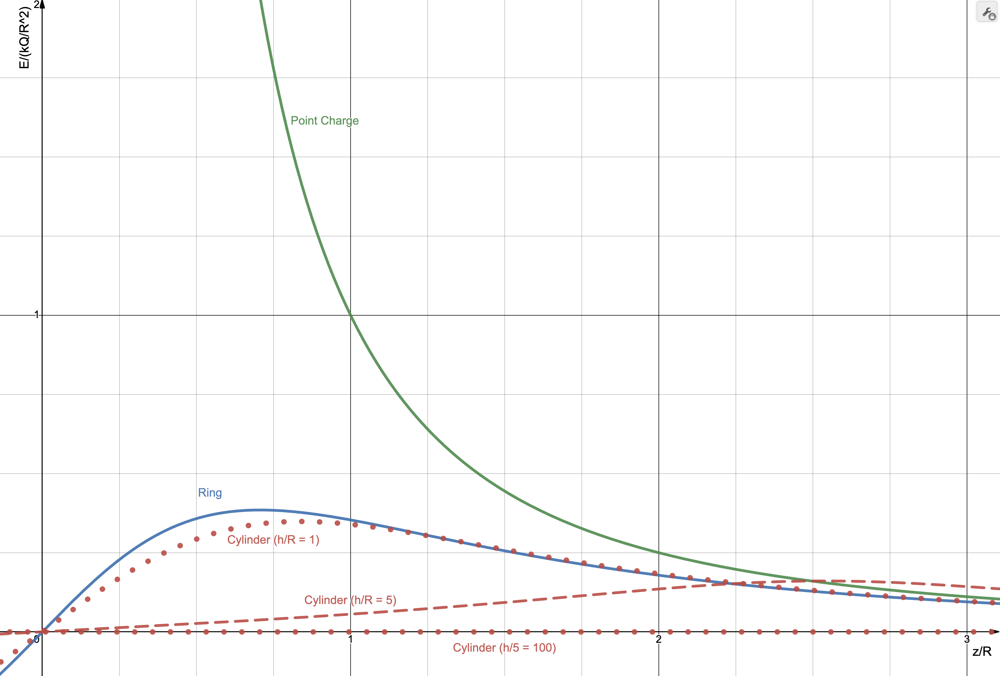
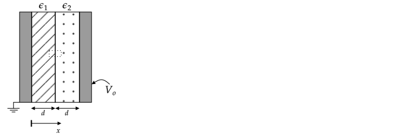

# HW 1

Due September 5th at 11:59 pm.

If you are stuck, please ask questions on Discord or send me questions via email.

Turn in all of your answers on paper.

## Continuous Charge Distribution Approximation

In E&M, we often assume that point charges are continuously distributed. This problem addresses the accuracy of this approximation.

A line of length $2L$ is centered on the origin and lies between $-L\le x\le L$. The charge density, $\lambda_o$, on the line is uniform.

If the line is approximated by an odd number of point charges (so a charge is always at the origin) separated by a distance $\Delta$ and is used to compute the approximate electric field $E_{ya}$ on the $y$-axis at $y=L$, how many charges are required so that

$$\left|\frac{E_{ye}(0,L)-E_{ya}(0,L)}{E_{ye}(0,L)}\right|\le 0.01$$

where the exact solution is given by $E_{ye}$.

You may look up the exact solution but cite your source. You may use any program or a calculator to solve this problem.

Print out the code you used for your answer and write the actual answer it yields in a comment.

Save your program as a file named `HW1_1.ext`, where `ext` is the file extension for your program, e.g., `m`, `py`, etc. You do not need to send me your code (unless you have a question about it), but in the future, I'll have you use GitHub to store your code with that filename.

**Solution**

Assume a charge at x of $\lambda dx$, with $dx$ small enough to be such that it is effectively a point charge. If this is the case, the vector from $x$ to $y=h$ is
$\mathbf{r} = -x\xhat + y\yhat$ and so

$$d\mathbf{E} = k (\lambda dx) \rhat/r^2 = k (\lambda dx) \mathbf{r}/r^3 = k (\lambda dx) (-x \xhat + y \yhat)/r^3$$

To find the electric field due to a summation of these charges at $x$ from $-L$ to $L$, integrate the above expression.The exact solution is (Griffiths 4th Edition, example 2.2):

$$E_y=2k\lambda_oL\frac{1}{y\sqrt{y^2+L^2}}$$

We want to re-write this is a form that will allow cancellation of constants that were not given when the above ratio is computed. Using $\lambda_o=Q/2L$, we have

$$E_y=\frac{kQ}{L^2}\frac{1}{\ds\frac{y}{L}\left[1+\left(\frac{y}{L}\right)^2\right]^{1/2}}$$

With $y=L$, 

$$E_y=\frac{kQ}{L^2}\frac{1}{\sqrt{2}}$$

For a charge $Q$ at position $(x,y)$

$$E_y=kQ\frac{y}{(y^2+x^2)^{3/2}}$$

Setting $y=L$, this can be written as

$$E_y=\frac{kQ}{L^2}\frac{1}{\ds\left[1+\left(\frac{y}{L}\right)^2\right]^{3/2}}$$

To compute the field due to multiple charges, we need to place charges at $x=-L,-L+\Delta, ..., L$. The spacing $\Delta/L$ is $2/(N-1)$.

With $kQ/L^2$ term omitted, the sum is

$$S(N)\equiv\frac{1}{N}\sum_{i=-(N-1)/2}^{(N-1)/2}\frac{1}{\ds\left[1+(i\Delta)^2\right]^{3/2}}$$

Before implementing, check that this sum is correct by expanding it for $N=3$, $N=5$.

**Important**: I want to see checks like this in your code. In analytical problems you should always use limits to check answer. In numerical problems, you should always use some sort of check on a reduced problem to check your implementation. The following checks took me some time, but because I had them, I was able to catch errors very quickly and also have confidence in my result. In my code, I also created two plots to help me build confidence in my result; see below. I plotted the sum as a function of $N$ and verified that it converged to a constant value (initially it did not, because I forgot to divide sum by $N$). I also plotted the error as a function of $N$ to verify that it was monotonically decreasing. (If it started increasing at some value of $N$, I would know that something went wrong.)

$N=3$, $\Delta=1$ and we want the sum terms to correspond to charges at $x/L=-1, 0, $ and $1$.

$$S(N)=\frac{1}{3}\sum_{i=-1}^{1}\frac{1}{\ds\left[1+(i\Delta)^2\right]^{3/2}}=
\frac{1/3}{\ds\left[1+(-1)^2\right]^{3/2}}+
\frac{1/3}{\ds\left[1+(0)^2\right]^{3/2}}+
\frac{1/3}{\ds\left[1+(1)^2\right]^{3/2}}
$$

The result is $0.569035593728849$. This value is used in the following program as a check.

$N=5$, $\Delta=2/(N-1)=1/2$ and we want charges at $x/L=-1, -1/2, 0, 1/2, $ and $1$.

$$S(N)=\frac{1}{5}\sum_{i=-2}^{2}\frac{1}{\ds\left[1+(i\Delta)^2\right]^{3/2}}=
\frac{1/5}{\ds\left[1+(-1)^2\right]^{3/2}}+
\frac{1/5}{\ds\left[1+(-1/2)^2\right]^{3/2}}+
\frac{1/5}{\ds\left[1+(0/2)^2\right]^{3/2}}+
\frac{1/5}{\ds\left[1+(1/2)^2\right]^{3/2}}+
\frac{1/5}{\ds\left[1+(1\Delta)^2\right]^{3/2}}
$$

The result is $0.627638057357283$.

Notice the fact that the first two and last two terms evaluate to the same value. This can be used to reduce the number of computations.

To finish the problem, evaluate 

$$\left|\frac{1/\sqrt{2}-S(N)}{1/\sqrt{2}}\right|\le 0.01$$

or $|1-\sqrt{2}S(N)|\le 0.01$

for odd positive values of $N$ until the inequality is satisified. The result should be $N=51$. 

The following two figures were used to check my algorithm. [Source code](solns/HW1_1.m)

## Charge on Cylinder

Charge is uniformly distributed on the curved surface of a cylinder of length $h$ and radius $R$. The cylinder is centered on the origin, aligned with the $z$--axis, and has a uniform charge density of $\sigma_o$.

Find $\mathbf{E}(z)$. Prior to doing any calculations, document limiting cases that you can use to check your answer.

**Answer**

Limiting cases:

* Expect zero at origin.
* Expect ring of charge solution as $h/R\rightarrow 0$
* Expect infinite cylinder solution when $h\gg R$

We also expect $E_z(z) = -E_z(z)$ (symmetry)

The field for uniformly charged ring in the $x$--$y$ plane and centered on the origin is

$$E_z=2\pi R\lambda k\frac{z}{\left(z^2+R^2\right)^{3/2}}=kQ\frac{z}{R^3}\frac{1}{\left(1+(z/R)^2\right)^{3/2}}$$

If the ring is translated along the $z$--axis by $z'$, this corresponds to a translation of the coordinate system and we can write

$$E_z=\frac{kQ}{R^2}\frac{\ds\left(\frac{z-z'}{R}\right)}{\ds\left(1+\left(\frac{z-z'}{R}\right)^2\right)^{3/2}}$$

If we consider differential rings of height $dz'$, their area is $2\pi Rdz'$ and charge is

$dQ=(2\pi Rdz')\sigma_o$

Replacing $E_z$ with $dE_z$ and $Q$ with $dQ$ in the last equation for $E_z$, we have

$$dE_z(z)=2\pi R k\frac{dz'}{R^2}\frac{\ds\left(\frac{z-z'}{R}\right)}{\ds\left(1+\left(\frac{z-z'}{R}\right)^2\right)^{3/2}}$$

and this must be integrated from $z'=-h/2$ to $z'=h/2$. The result is

$$E_z(z)=
\frac{kQ}{R^2}
\left[
\frac{1}{h_R\sqrt{(\frac{z}{R}-\frac{h_R}{2})^2+1}}-
\frac{1}{h_R\sqrt{(\frac{z}{R}+\frac{h_R}{2})^2+1}}
\right]
$$

where $h_R \equiv h/R$. 

(The solution was written in this form in anticipation for a problem on HW #2.)

Checks:

* $E_z(0)=0$ is satisfied.
* We expect ring of charge solution as $h/R=h_R\rightarrow 0$. However, when we plug this into the above, we get $1/0-1/0$, which is indeterminate.
* Expect infinitely long and uniformly charged cylinder solution when $h\gg R$ (or $h_R\gg 1$). When we plug this into the above, we get $0$. This can be shown to be correct using Gauss's law, from which it follows that $E_z=0$ at all points inside the cylinder (not only along $z$--axis, which we computed above).

The symmetry condition $E_z(z) = -E_z(z)$ is satisifed.

Addressing the last two limits requires a significant amount of effort ([see related problem](https://rweigel.github.io/phys685/hw.html#surface-current-on-cylinder)). In the next homework, you will consider an alternative approach.

## Reading

Next week, Gauss's law will be covered. Find at least one freshman--level textbook and read the sections that cover Gauss's law. Do the same for at least one upper--division undergraduate--level textbook (the references on the syllabus has a list of textbooks, but you may pick your own).

In the next class,

* We will have a general discussion on the similarities and differences in how Gauss's law is presented and explained.
* I will randomly select students (or groups) to present the solution to a problem of your choosing on the whiteboard. Prepare notes for a 5--7 minute presentation (no PowerPoint, only hand--written notes). During your presentation, I will ask the class for clarifications and connections to other problems. You are welcome and encouraged to work with one or two other students on this. Stated a different way, I would like you to review Gauss's law from multiple sources, pick a problem you think you can explain (it can be a textbook example problem, in which case explain it in your own words), and prepare a short presentation of the solution. We'll find that all solutions (even textbook examples) have many subtleties.

Turn in your notes that you have prepared for a presentation.

# HW 2

Due September 12th at 11:59 pm. Due to the fact that I forgot to post this on time, if you need an extensison, feel free to ask.

Upload your solutions to GitHub. Name all files associated with your solution as `HW2_x.EXT`, where `x` = 1, 2, 3, 4 is the problem from this homework and `EXT` is the file extension, e.g., `pdf`, `py`, `m`. Upload all files associated with your solution such as code and notes (in PDF).

If you are stuck, please ask questions on Discord or send me questions via email. Be prepared to answer questions about your answers to these problems. Even if you have not completed them, I will ask for your ideas on how to approach them.

## Limiting Behavior For Cylinder

In the previous HW, you computed the electric field along the centerline of a cylinder with a uniform surface charge on its curved surface.

Showing that the equation approaches the equation for a point charge at the origin when $z\gg R$ and $z\gg h$ is not trivial. (Plugging $R=0$ and $h=0$ gives $E_z(z)=0$.) To show that $E_z(z)$ has the correct limiting behavior mathematically is quite involved. As an alternative, we will check the limit graphically.

Create a plot of $E_z(z/R)/E_o$, where $E_o = kQ/R^2$ for (that is, plot $E_z/E_o$ vs $z/R$):

1. A point charge $Q$ at the origin
2. A ring of radius $R$ that is centered on the origin and lies in the $x$--$y$ plane with a uniformly distributed charge $Q$.
3. The cylinder considered on the previous homework assuming for three cases: $h/R=1$, $h/R=5$, and $h/R=100$.
 
Be prepared to provide a physical explanation for the features of the curves and the ratios of $h/R$.

\ifsolutions
**Solution**

The following plot was created using https://www.desmos.com/calculator/vg2dblcbfc. This page is interactive, so you can adjust the $h/R$ ratio.

Comments:

* By using the dimensionless ratio, we can easily compare the fundamental features of the cylinder equation using only one parameter. If instead we plotted $E$ vs $z$, we would need to plot the equation for many values of $R$ and $h$ to understand the full range shapes the equation can have.
* As $h/R$ decreases, the cylinder solution approaches the ring solution. For $h/R=0.1$, the lines for the ring and cylinder cannot be distinguished by eye.
* For $h/R=1$, the cylinder and ring curves increasingly overlap starting at approximately $z/R=1$. This means the cylinder field is becoming more and more like the ring field as $z/R$ increases, which is expected.
* The ring and cylinder curves (for $h/R=1$) overlap with the point charge curve for large $z/R$. This is expected because both being to "look" like a point charge as you move away from them.
* The explanation for the curve approaching zero as $r/R$ increases is in this limit, the cylinder appears to be "long". Inside of an infinitely long cylinder $h/R\rightarrow \infty$, the field is zero (even off--axis). This can be shown by using Gauss's law.
* All curves have odd symmetry ($E(-z)=-E(z)$), as expected -- the field for $z>0$ is positive and the field for $z<0$ is negative. (The image below only shows $z/R > 0$.)

\fi

## Checking Gauss's Law

Given a point charge $Q$ at the origin, compute the electric flux $\Phi_E=\int\mathbf{E}\bfcdot d\mathbf{A}$ through one face of a cube that is also centered on the origin using Coulomb's law and explicit evaluation of the integral.

\ifsolutions

**Solution**

From Gauss's law, the net flux through any _closed_ surface is $Q_{encl}/\epsilon_o$. The net flux through the cube's surface is $Q/\epsilon_o$, and the flux must be the same through each face, so we expect the answer to be $Q/6\epsilon_o$. In this problem, you are being asked to show that you get the same result without using Gauss's law.

Several students solved for case when cube was not centered on the origin but rather had one corner at the origin and edges along the cartesian coordinate axes. In this case, one can conclude the flux through one face should be $Q/24\epsilon_o$. This is equivalent to asking if we split the given cube into $8$ sub--cubes, what is the flux through the outer face of one of the sub-cubes. In this case, the face area of the sub--cube is $1/4$ of the area of the main cube. In addition to being the wrong problem, the solution given does not use Coulomb's law and explicit evaluation of the integral. (The motivation for this problem is to reinforce the idea that Gauss' law holds for arbitrary surfaces and as practice for setting up integration.)

In general,

$\mathbf{r}=x\xhat + y\yhat + z\zhat$. If we assume the side length is $2a$, then for the top side, $\mathbf{r}=x\xhat + y\yhat + a\zhat$.

We need to evaluate

$$\Phi_E=\int_{\text{top}}\mathbf{E}\bfcdot d\mathbf{A}$$

Using

$\ds\mathbf{E}=kq\frac{\mathbf{r}}{r^3}$ and $d\mathbf{A}=dxdy\hat{\mathbf{z}}$, the integral is

$$\Phi_E=kq\int_{-a}^{a}dy\int_{-a}^{a}\frac{adx}{\sqrt{a^2+x^2+y^2}^{3/2}}$$

or, nondimensionalizing the integral using $x\rightarrow x/a$ and $y\rightarrow y/a$,

$$\Phi_E=kq\int_{-1}^{1}dy\int_{-1}^{1}\frac{dx}{\sqrt{1+x^2+y^2}^{3/2}}$$

Defining $b^2=1+y^2$ and using [Wolfram Alpha for the integration](https://www.wolframalpha.com/input?i=integrate+1%2F%28sqrt%28b%5E2%2Bx%5E2%29%29%5E%283%29+from+-1+to+1), we have

$$\Phi_E=kq\int_{-1}^{1}dy\frac{2}{(1+y^2)\sqrt{2+y^2}}$$

Using [Wolfram Alpha](), $\Phi_E=kq(2\pi/3)=q/6\epsilon_o$.
\fi

## Charge on Concentric Thick Shells

Charge placed on concentric spherical conducting shells, the cross--section of which is shown. Both shells have a thickness of $t$. The inner shell has an outer radius of $a$ and a net charge of $-Q$. The outer shell has an inner radius of $b$ and a net charge of $+Q$. Assume that $Q$ is positive.

Using Gauss's law and the fact that the electric field inside a conductor must be zero show that

1. there can be no charge on the inner surface of the inner conductor,

   \ifsolutions
    **Answer**: A Gaussian sphere with a surface inside the inner conductor has $E=0$ on its surface (b/c $E$ inside a conductor is zero). Based on $\oint \bfvec{E}\bfcdot d\mathbf{l}=Q_{\text{encl}}/\epsilon_o$, this implies $Q_{\text{encl}}=0$. (Note that all charges must be on the surface of a conductor, so the only possible location for the charge is on the inner and outer surfaces.)
   \fi

2. the charge on the inner surface of the outer conductor is $+Q$, and

   \ifsolutions
    **Answer**: A Gaussian sphere with its surface inside the outer conductor has $E=0$ on its surface (b/c $E$ inside a conductor is zero). Based on $\oint \bfvec{E}\bfcdot d\mathbf{A}=Q_{\text{encl}}/\epsilon_o$, this implies $Q_{\text{encl}}=0$. The charge on the inner conductor was given as $-Q$. To make the charge inside the Gaussian sphere zero, we need $+Q$ on the inner surface of the outer conductor to get $Q_{\text{encl}}=0$.
   \fi

3. there is no charge on the outer surface of the outer conductor.

   \ifsolutions
    **Answer**: If the total charge on the outer conductor is $+Q$ and all of it is on its inner surface, but conservation of charge, there is no charge on its outer surface. Recall that charges arrange themselves on a conductor to make the electric field inside all conductors zero. With this charge arrangement, the field due to the charges on the outer surface of the inner conductor cancels the field due to the charge on the inner surface of the outer conductor for $r>b$.
   \fi

4. Find the electric field in each of the five labeled regions and sketch a plot of $E/(kQ/a^2)$ versus $r/a$. Region 1. is the empty volume inside of the inner conductor, region 2. is the inner conductor, region 3. is the empty volume between the conductors, region 4. is the outer conductor, and region 5. is the region outside of the outer conductor. (Hint: Use Gauss's law several times; when not zero, the electric field should be proportional to $1/r^2$.)

   \ifsolutions
   **Answer**: 1. $E=0\quad$ 2. $E=0\quad$ 3. $E/(kQ/a^2)=-1/(r/a)^2\quad$ 4. $E=0\quad$ 5. $E=0$
   \else
   \vspace{4em}
   \fi

## Scalar Potential

Because the electric field has the form of $\rhat/r^2$, it can be shown that we can always find a scalar function $\psi$ (which we call electric potential) such that

$$\mathbf{E}=-\boldsymbol{\nabla}\psi = -{\partial \psi \over \partial x}\xhat - {\partial \psi \over \partial y}\yhat - {\partial \psi \over \partial z}\zhat$$

It can be shown that this equation can be inverted:
   
$$\psi(\mathbf{r})-\psi(\mathbf{r}_o)=-\int_{\mathbf{r}_o}^{\mathbf{r}}\mathbf{E}\bfcdot d\mathbf{l}$$
   
where the integral is taken over _any_ path between the points given by $\mathbf{r}$ and $\mathbf{r}_o$.

In one dimension, assuming the integration path is radial, and choosing $\mathbf{r}_o$ to be the origin, we have
   
$$\psi(r)-\psi(0)=-\int_0^rE_r(r)dr$$
   
Using the electric field from problem [2.3.4](#charge-on-concentric-thick-shells) and assuming $\psi(0)=0$ (I will discuss why this choice is arbitrary in class), find and sketch a plot of $\psi/(kQ/a)$ versus $r/a$.
   
In class, I will ask for a physical explanation for why I will get the same result if I choose a different integration path. For example, if my integration path was radial, then tangential, then radial again. This is covered in most intro textbooks. I'll also ask why I ask for plots of dimensionless parameters in this problem and in other problems on this HW.

\ifsolutions
**Solution**

In region 1, $\ds\psi(r)-\psi(0)=-\int_0^r 0 dr \Rightarrow \psi(r)=0$ and $\psi(a-t)=0$.

In region 2, $\ds\psi(r)-\psi(a-t)=-\int_{a-t}^r 0 dr \Rightarrow \psi(r)=0$ and $\psi(a)=0$.

The fact that the potential is constant in region 2. is consistent with the expectation that a conductor is an equipotential.

In region 3, $\ds\psi(r)-\psi(a)=kQ\int_a^r 1/r'^2 dr' \Rightarrow \psi(r) = kQ(1/a-1/r)$ and so $\psi(b)=kq(1/a-1/b)$

In region 4., the potential will be the same as in region 3. because a conductor is an equipotential: $\psi(r)=\psi(b)$

In region 5., assuming the outer radius of the outer shell is $c$, $\ds\psi(r)-\psi(c)=-\int_c^r 0 dr \Rightarrow \psi(r)=\psi(c)$. Because $\psi(r)$ in region 4. is constant and equal to $\psi(b)$, $\psi(c)=\psi(b)$.

\fi

# HW 3

Due September 19th at 11:59 pm. 

Upload your solutions to GitHub. Name all files associated with your solution as `HW3_x.EXT`, where `x` = 1, 2, 3 is the problem from this homework and `EXT` is the file extension, e.g., `pdf`, `py`, `m`. Upload all files associated with your solution such as code and notes (in PDF). If your PDF is larger than a few MB, [compress it](https://www.adobe.com/acrobat/online/compress-pdf.html).

If you are stuck, please ask questions on Discord or send me questions via email. Be prepared to answer questions about your answers to these problems. Even if you have not completed them, I will ask for your ideas on how to approach them.

## Concentric Spheres and a Charged Shell

Suppose problem 2.3 is modified so that there is also a uniformly charged spherical shell with a radius $(a + b)/2$ and a total charge of $Q/2$.

1. Find the electric field in the five labeled regions and sketch a plot of $E/(kQ/a^2)$ versus $r/a$.
2. Do the same for the electric potential and plot $\psi/(kQ/a)$ versus $r/a$. Assume the potential at $r=0$ is zero.
3. In this problem the electric field "jumps" when crossing over charges on a surface. (That is, there is a discontinuity in the $E(r)$ plot.) For each of the jumps in the plot of $E$, find the ratio of the change in $E$ across the discontinuity and the charge density at the discontinuity.

\ifsolutions
**Comments**:
1. This was discussed in class. For a sketch, I set $b=2a$ to simplify.
2. One can visualize the answer by inverting the sketch from 1. and asking what the cumulative sum of that plot will look like. A key feature is that the curve is continuous (but the first derivative, related to $E$, will be discontinuous). Many students had discontinuities.
3. The jumps should be $\sigma/\epsilon_o$, where $\sigma$ is the surface charge density at the location of the jumps.

I will not post solutions because there are many ways of checking your answer; you may want to try this problem again in case it shows up on an exam.
\fi

## Capacitance for a Long Cylinder

In class, I covered how to compute capacitance for (a) large conducting planes with a small separation distance and (b) the system in HW 2.3. This was done using two methods:

1. Gauss's law (put $+Q$ on one conductor $-Q$ on another, use Gauss's law to find $E$, use $E$ to compute the potential difference, then use $C=Q/|\Delta \psi|$
2. Laplace's equation (put one conductor at a potential of $V_o$ and the other at $0$; solve $\nabla^2\psi=0$ for $\psi$, compute $E$ and use it to find $\sigma$; from $\sigma$, compute $Q$; then use $C=Q/|\Delta \psi|$.)

Use these two methods to find the capacitance of two equal-length and long concentric cylinders. Assume the diagram in HW 2.3 is the cross-section. 

\ifsolutions
**Comment**: Most students used the equation for the spherical problem for both parts. For part 1., $E\sim 1/r$ (see intro books which cover this). For part 2., the Laplacian in cylindrical coordinates, not spherical, should be used. It is

$$\nabla^2 = \frac{1}{s}\frac{\partial}{\partial s}\left(s\frac{\partial\Phi}{\partial s}\right)$$

where $s$ is the radial cylindrical coordinate. If you made this error, try the problem again and verify that you get the same answer for parts 1. and 2.

\fi

## Laplace's Equation in Two Dimensions -- Numerical

1. Verify the numbers in the Step 1 column of Table 1.20 of Ramo. Show your calculations on a piece of paper. (In class, we will develop a program to compute the potentials in the other columns.)

2. Find the equation for this problem's exact potential if all sides are set to have zero potential except the side at $80\text{ V}$ (you do not need to derive -- citing a reference is acceptable). I recommend finding a solution first and using it to answer this part; if you have time, attempt to derive it.

(If you want to work ahead, develop a numerical solution to this problem and compare it to the exact solution.)

\ifsolutions
**Answers**

1.
   * $\Phi_1=77.50$
   * $\Phi_2=65.62$
   * $\Phi_3=70.62$
   * $\Phi_4=54.06$
2. This problem is given in many books as an example and here I expected you to research to find a solution. Problem 3.54 of Griffiths 4th Edition has a solution for the case when the origin is at the bottom center of the duct, the top is held at $V$, the width is $2b$ and the height is $a$.

   $$\Phi(x,y) = -\frac{2V}{b}\sum_{n=1}^{\infty}\frac{(-1)^n}{\alpha_n}\frac{\sinh(\alpha_n y)}{\sinh(\alpha_n a)}\cos(\alpha_n x)$$

   where $\alpha_n=(2n-1)\pi/2b$. To transform this to the problem we are given, first set the width $2b$ to $1$ and height $a=1$. Then

   $$\Phi(x,y) = -4V\sum_{n=1}^{\infty}\frac{(-1)^n}{\alpha_n}\frac{\sinh(\alpha_n y)}{\sinh(\alpha_n)}\cos(\alpha_n x)$$

   $\alpha_n=(2n-1)\pi$. If we choose a coordinate system the is centered on the right edge of Figure 1.20a with $y$ to the left and $x$ upwards, this equation can be used.

   One can show that if the origin is placed at the lower left of the duct in Figure 1.20a, with $x$ to the right and $y$ up, the potential is
   $$\Phi_l(x,y)=\frac{4V}{\pi}\sum_{n=1,3,...}^\infty \frac{\sin(n\pi y/y_0)}{n\sinh (n\pi y_0/x_0)}\sinh\left[n\pi(x_0-x)/y_0\right]$$

   where $V=80\text{ V}$ and the width $x_o=1$ and height $y_o=1$.
\fi

# HW 4

Due September 26th at 11:59 pm.

Upload your solutions to GitHub. Name all files associated with your solution as `HW4_x.EXT`, where `x` = 1, 2, 3 is the problem from this homework and `EXT` is the file extension, e.g., `pdf`, `py`, `m`. Upload all files associated with your solution such as code and notes (in PDF). If your PDF is larger than a few MB, [compress it](https://www.adobe.com/acrobat/online/compress-pdf.html).

## Laplace's Equation in 1--D Cylindrical -- Numerical

1. Use similar steps to derive a numerical algorithm for solving numerically solving Laplace's equation in 1--D cylindrical. (In class, I discussed solving the spherical version of this problem.)

2. If $\Phi(r=2)=1$ and $\Phi(r=1)=0$, use your algorithm from 1. to find the potential at $r=1.5$. (Use a grid with points at $r=1$, $r=1.5$, and $r=2$.)
3. Repeat 2. using a grid with points at $r=1$, $r=4/3$, $r=5/3$, and $r=2$.

## 1--D Spherical 

A spherical shell of radius $r_o=(a + b)/2$ and a uniform charge density $\sigma_o$ is concentric with 
conducting spheres with the inner sphere having radius $a$ and the outer radius $b$. Both conducting spheres are at zero potential.

1. In the previous homework, you used Gauss's law to find the $E(r)$ and $V(r)$ for the same geometry and were given the charge on each surface. In this problem, use the fact that in the regions $[a, r_o]$ and $[r_o,b]$, $\nabla^2\Phi=0$ the fact that $\Phi(a)=\Phi(b)=0$ to find $\Phi(r)$ for $a\le r \le b$.

   You will need to use the fact that the potential is continuous, so $\Phi_1(r_o)=\Phi_2(r_o)$ and also a condition that relates the electric field at $r=r_o^-$ and $r=r_o^+$.

2. Find the charge on both conductors.

## A Model of Polarization

In Example 4.3 of Griffiths (3rd and 4th Edition), he models a polarized sphere by using two uniformly charged spheres with centers that are separated by a small distance. 

In this problem, a polarized slab will be modeled using two slabs of charge with uniform and opposite charge density that are offset by a small distance $\delta$.

1. Find $\mathbf{E}^+(y)$ for the slab with uniform charge density $\rho_o$ shown in the following figure. Assume that the slab is infinite in extent in the $\pm z$ and $\pm x$ directions so that Gauss's law can be used to find $\mathbf{E}$. (This slab can be thought of as being composed of thin sheets of charge stacked together, so an alternative to using Gauss's law is to sum the electric field due to sheets of charge.)

   

2. Sketch (by hand is fine) $\mathbf{E}^+(y)$ vs $y$. Label key points on the $y$--axis.

3. Next, compute and sketch (by hand is fine) $\mathbf{E}^-(y)$ for the same slab if it had charge density of $-\rho_o$ and was shifted by $-\delta$ in the $y$--direction. Assume that $\delta\ll t$.

4. Compute and sketch $\mathbf{E}^+ + \mathbf{E}^-$.

The primary motivation of this problem is to justify the claim that the field of a polarized object can be computed not by finding the field due to all of the dipoles but rather by finding the field created by so--called "bound" charge densities. Here, the field due to the dipoles approaches the field due to sheets of charge. This fact is addressed in the following problem.

## Polarized Cylinder

For background, see Griffiths 4.1--4.4, Introduction to Electrodynamics (3rd or 4th Edition).

A result in section 4.2 is that the electric potential (and also electric field, which is related to electric potential) of a polarized object can be found by computing the bound surface and volume charge densities $\sigma_b$ and $\rho_b$, respectively. That is, instead of computing the electric field due to each dipole in a polarized object, we can get the same answer by computing the electric field due to $\sigma_b$ and $\rho_b$ by using the same methods used to find the electric field due to ordinary charges $\sigma$ and $\rho$ (Gauss's law or solving the Poisson equation).

Suppose a cylinder of radius $a$ has $\mathbf{P}=P_o\hat{\mathbf{s}}$, where $s$ is the cylindrical radial coordinate. The cylinder is long, and its centerline is the $z$ axis.

1. Find $\sigma_b$ and $\rho_b$.
2. Compute the total bound charge.
2. Find $\mathbf{E}_b(s)$, which is the electric field due to $\sigma_b$ and $\rho_b$.

# HW 5

Due Friday, October 4th at 11:59 pm.

## Laplace's Equation in 2-D Cartesian -- Numerical

Determine if the "Correct Potentials" column in Table 1.20 of Ramo are correct using the analytical solution covered in HW 3.3.

Write out the equations that were evaluated to compute the potentials in a file named `HW5_1.pdf` and any code as `HW5_1.ext`, where ext is the file name extension for the language, e.g., `m` or `py`. (As before, you do not need to derive the analytical solution -- you can simply cite the source of one and adapt it to this problem.)

## Capactor with Dielectrics -- Analytical

(Related problems are in section 1.15 of Ramo and example 4.5 of Griffiths 3rd and 4th edition.)

A large parallel plate capacitor is half--filled with two linear dielectrics with permittivities of $\epsilon_1$ and $\epsilon_2$. Assume that the capacitor is large enough that the potential only varies in the $x$--direction. In the diagram, the dotted rectangle is the cross--section of a Gaussian cylinder referenced in parts 4. and 5.

1. Solve $\nabla^2 \psi=0$ in each dielectric using $\psi_1(0)=0$, $\psi_2(2d)=V_o$, $\psi_1(d)=\psi_2(d)$ and $D_1(d)=D_2(d)$.
   \ifsolutions
   $$\frac{V_1}{V_o} = \left(\frac{\epsilon_2}{\epsilon_1+\epsilon_2}\right)\frac{x}{d}$$ 

   $$\frac{V_2}{V_o} = \left(\frac{\epsilon_1}{\epsilon_1+\epsilon_2}\right)\frac{x}{d} + \frac{\epsilon_2-\epsilon_1}{\epsilon_1+\epsilon_2}$$
   \fi
2. Verify that when $\epsilon_1=\epsilon_2=\epsilon_o$, the answer is as expected from a problem solved previously in class.

   \ifsolutions
   **Answer**
   In this case, $V_1/V_o = V_2/V_o = x/2d$, which is a solution to Laplace's equation that matches the boundary conditions (and so is the unique solution).
   \fi

Using your answer to 1.,

3. use $\sigma_b=\mathbf{P}\bfcdot\hat{\mathbf{n}}$ to find the four bound surface charge densities (that is, the bound charge density on the left and right surfaces on both dielectrics);

Save your answer in a file named `HW5_2.pdf`.

## Capactor with Dielectrics -- Numerical

Find a numerical approximation of the (1--D) potential for the previous problem. Do this using the "Simple Averaging Method" described in Example 1.20 of the textbook. Use grid points at $x=0, d/2, d, 3d/2$, and $2d$. You only need to find the approximation using one step of the simple averaging method.

Hint: For any grid point that is not at $x=d$, the potential is simply the average of the potentials to the left and right. For a grid point at $x=d$, you will need to find an equation that numerically implements the exact condition $D_1(d)=D_2(d)$. If your grid points are at $x=0, d$, and $2d$, the only equation that you will solve is the equation for the condition $D_1(d)=D_2(d)$. Try this version of the problem first. Does it give a sensible result when $\chi_{e2}\rightarrow \infty$ or if $\epsilon_1=\epsilon_2$?

Save your derivation and numerical values for the potential in a file named `HW5_3.pdf` and any code as `HW5_2.ext`, where ext is the file name extension for the language, e.g., `m` or `py`.

